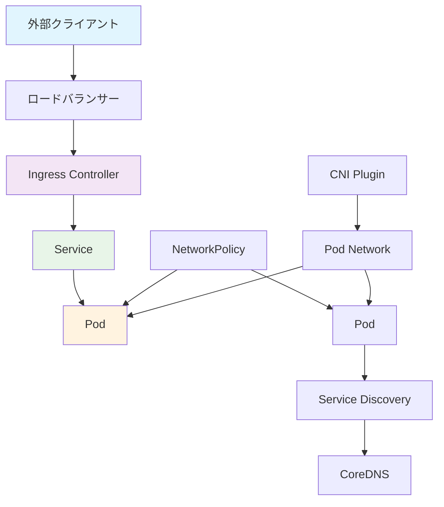

# 🌐 ネットワーキング (Networking)

このガイドでは、Kubernetesにおけるクラスター内外の通信とトラフィック制御について学習します。AWS ECSでのALB/NLBの使用経験を活かしながら、Kubernetesの柔軟なネットワーキングモデルを理解します。

## 🎯 学習目標

- Kubernetesネットワークモデルの理解
- Service、Ingress、Gateway APIの使い分け
- DNS による サービスディスカバリの仕組み
- AWS ロードバランサーとの統合方法

## 📚 Kubernetesネットワーキングの基本概念

### 🏗️ ネットワークアーキテクチャ



### 🔄 ネットワーク通信の階層

1. **Container-to-Container**: Pod内通信（localhost）
2. **Pod-to-Pod**: クラスター内Pod間通信
3. **Pod-to-Service**: サービス経由の通信
4. **External-to-Service**: 外部からの通信

## 🎯 Service: 内部通信とサービスディスカバリ

### 📋 Service の種類

#### 1. ClusterIP - 内部通信専用

```yaml
# デフォルトのService（クラスター内部のみ）
apiVersion: v1
kind: Service
metadata:
  name: database-service
  namespace: production
spec:
  type: ClusterIP  # デフォルト
  selector:
    app: postgres
    tier: database
  ports:
  - name: postgres
    port: 5432        # Service のポート
    targetPort: 5432  # Pod のポート
    protocol: TCP

---
# Web アプリケーションからの接続例
apiVersion: apps/v1
kind: Deployment
metadata:
  name: web-app
  namespace: production
spec:
  template:
    spec:
      containers:
      - name: web-app
        image: myapp:latest
        env:
        - name: DATABASE_HOST
          value: "database-service.production.svc.cluster.local"
        - name: DATABASE_PORT
          value: "5432"
```

#### 2. NodePort - ノード経由アクセス

```yaml
# 開発環境での外部アクセス用
apiVersion: v1
kind: Service
metadata:
  name: web-app-nodeport
  namespace: development
spec:
  type: NodePort
  selector:
    app: web-app
  ports:
  - name: http
    port: 80          # Service内部ポート
    targetPort: 8080  # Podのポート
    nodePort: 30080   # ノードのポート（30000-32767）
    protocol: TCP

---
# アクセス方法: http://<node-ip>:30080
```

#### 3. LoadBalancer - 外部ロードバランサー

```yaml
# AWS ELB/ALB 統合
apiVersion: v1
kind: Service
metadata:
  name: web-app-lb
  namespace: production
  annotations:
    # AWS Load Balancer Controller の設定
    service.beta.kubernetes.io/aws-load-balancer-type: "nlb"
    service.beta.kubernetes.io/aws-load-balancer-scheme: "internet-facing"
    service.beta.kubernetes.io/aws-load-balancer-cross-zone-load-balancing-enabled: "true"
spec:
  type: LoadBalancer
  selector:
    app: web-app
  ports:
  - name: http
    port: 80
    targetPort: 8080
    protocol: TCP
  - name: https
    port: 443
    targetPort: 8080
    protocol: TCP

---
# ALB (Application Load Balancer) の場合
apiVersion: v1
kind: Service
metadata:
  name: web-app-alb
  annotations:
    service.beta.kubernetes.io/aws-load-balancer-type: "alb"
    service.beta.kubernetes.io/aws-load-balancer-scheme: "internet-facing"
    service.beta.kubernetes.io/aws-load-balancer-ssl-cert: "arn:aws:acm:region:account:certificate/cert-id"
spec:
  type: LoadBalancer
  selector:
    app: web-app
  ports:
  - port: 443
    targetPort: 8080
```

#### 4. ExternalName - 外部サービス参照

```yaml
# 外部サービスのエイリアス
apiVersion: v1
kind: Service
metadata:
  name: external-database
  namespace: production
spec:
  type: ExternalName
  externalName: rds.us-west-2.amazonaws.com
  ports:
  - port: 5432

---
# 使用例
apiVersion: apps/v1
kind: Deployment
metadata:
  name: app
spec:
  template:
    spec:
      containers:
      - name: app
        env:
        - name: DB_HOST
          value: "external-database.production.svc.cluster.local"
```

### 🔍 Headless Service

```yaml
# StatefulSet 用 Headless Service
apiVersion: v1
kind: Service
metadata:
  name: postgres-headless
  namespace: database
spec:
  clusterIP: None  # Headless
  selector:
    app: postgres
  ports:
  - name: postgres
    port: 5432
    targetPort: 5432

---
# 個別Pod への直接アクセス
# postgres-0.postgres-headless.database.svc.cluster.local
# postgres-1.postgres-headless.database.svc.cluster.local
# postgres-2.postgres-headless.database.svc.cluster.local
```

## 🌍 Ingress: HTTP/HTTPS ルーティング

### 🔧 基本的なIngress設定

```yaml
# AWS Load Balancer Controller を使用
apiVersion: networking.k8s.io/v1
kind: Ingress
metadata:
  name: web-app-ingress
  namespace: production
  annotations:
    # AWS ALB 設定
    kubernetes.io/ingress.class: alb
    alb.ingress.kubernetes.io/scheme: internet-facing
    alb.ingress.kubernetes.io/target-type: ip
    
    # SSL設定
    alb.ingress.kubernetes.io/certificate-arn: arn:aws:acm:region:account:certificate/cert-id
    alb.ingress.kubernetes.io/listen-ports: '[{"HTTP": 80}, {"HTTPS": 443}]'
    alb.ingress.kubernetes.io/redirect-to-https: "true"
    
    # ヘルスチェック
    alb.ingress.kubernetes.io/healthcheck-path: /health
    alb.ingress.kubernetes.io/healthcheck-interval-seconds: "30"
    alb.ingress.kubernetes.io/healthcheck-timeout-seconds: "5"
    alb.ingress.kubernetes.io/healthy-threshold-count: "2"
    alb.ingress.kubernetes.io/unhealthy-threshold-count: "3"

spec:
  rules:
  # メインドメイン
  - host: myapp.example.com
    http:
      paths:
      - path: /
        pathType: Prefix
        backend:
          service:
            name: web-frontend
            port:
              number: 80
      
      - path: /api
        pathType: Prefix
        backend:
          service:
            name: api-backend
            port:
              number: 8080
  
  # 管理画面
  - host: admin.myapp.example.com
    http:
      paths:
      - path: /
        pathType: Prefix
        backend:
          service:
            name: admin-frontend
            port:
              number: 80

  # TLS設定
  tls:
  - hosts:
    - myapp.example.com
    - admin.myapp.example.com
    secretName: myapp-tls-secret
```

### 🎛️ 高度なIngress設定

```yaml
# カナリアデプロイメント用Ingress
apiVersion: networking.k8s.io/v1
kind: Ingress
metadata:
  name: canary-ingress
  annotations:
    nginx.ingress.kubernetes.io/canary: "true"
    nginx.ingress.kubernetes.io/canary-weight: "10"  # 10%のトラフィック
    nginx.ingress.kubernetes.io/canary-by-header: "X-Canary"
spec:
  rules:
  - host: myapp.example.com
    http:
      paths:
      - path: /
        pathType: Prefix
        backend:
          service:
            name: web-app-canary
            port:
              number: 80

---
# レート制限付きIngress
apiVersion: networking.k8s.io/v1
kind: Ingress
metadata:
  name: rate-limited-api
  annotations:
    nginx.ingress.kubernetes.io/rate-limit-connections: "10"
    nginx.ingress.kubernetes.io/rate-limit-requests-per-minute: "60"
    nginx.ingress.kubernetes.io/auth-type: basic
    nginx.ingress.kubernetes.io/auth-secret: api-auth
spec:
  rules:
  - host: api.myapp.example.com
    http:
      paths:
      - path: /
        pathType: Prefix
        backend:
          service:
            name: api-service
            port:
              number: 8080
```

## 🚀 Gateway API: 次世代ネットワーキング

### 🔧 Gateway API の基本構成

```yaml
# GatewayClass: 実装の定義
apiVersion: gateway.networking.k8s.io/v1beta1
kind: GatewayClass
metadata:
  name: aws-gateway-class
spec:
  controllerName: gateway.networking.aws.com/controller

---
# Gateway: 実際のゲートウェイインスタンス
apiVersion: gateway.networking.k8s.io/v1beta1
kind: Gateway
metadata:
  name: production-gateway
  namespace: gateway-system
spec:
  gatewayClassName: aws-gateway-class
  listeners:
  - name: http
    protocol: HTTP
    port: 80
    allowedRoutes:
      namespaces:
        from: All
  
  - name: https
    protocol: HTTPS
    port: 443
    tls:
      certificateRefs:
      - name: myapp-tls-cert
    allowedRoutes:
      namespaces:
        from: All

---
# HTTPRoute: L7 ルーティング
apiVersion: gateway.networking.k8s.io/v1beta1
kind: HTTPRoute
metadata:
  name: web-app-route
  namespace: production
spec:
  parentRefs:
  - name: production-gateway
    namespace: gateway-system
  
  hostnames:
  - "myapp.example.com"
  
  rules:
  # 静的ファイル
  - matches:
    - path:
        type: PathPrefix
        value: /static
    backendRefs:
    - name: static-files-service
      port: 80
      weight: 100
  
  # API エンドポイント
  - matches:
    - path:
        type: PathPrefix
        value: /api
    - headers:
      - name: X-Version
        value: v2
    backendRefs:
    - name: api-v2-service
      port: 8080
      weight: 90
    - name: api-v1-service
      port: 8080
      weight: 10
  
  # デフォルトルート
  - matches:
    - path:
        type: PathPrefix
        value: /
    backendRefs:
    - name: web-frontend-service
      port: 80

---
# TCPRoute: L4 ルーティング
apiVersion: gateway.networking.k8s.io/v1alpha2
kind: TCPRoute
metadata:
  name: database-route
  namespace: production
spec:
  parentRefs:
  - name: production-gateway
    namespace: gateway-system
    sectionName: tcp
  
  rules:
  - backendRefs:
    - name: postgres-service
      port: 5432
      weight: 100
```

### 🎯 トラフィック分割とカナリア

```yaml
# 段階的なカナリアデプロイメント
apiVersion: gateway.networking.k8s.io/v1beta1
kind: HTTPRoute
metadata:
  name: canary-deployment
  namespace: production
spec:
  parentRefs:
  - name: production-gateway
    namespace: gateway-system
  
  hostnames:
  - "myapp.example.com"
  
  rules:
  # ベータテスター向け（ヘッダーベース）
  - matches:
    - headers:
      - name: X-User-Type
        value: beta
    backendRefs:
    - name: app-v2-service
      port: 80
      weight: 100
  
  # 地域別ルーティング
  - matches:
    - headers:
      - name: X-Region
        value: us-west
    backendRefs:
    - name: app-west-service
      port: 80
      weight: 100
  
  # 段階的ロールアウト（重み付けベース）
  - matches:
    - path:
        type: PathPrefix
        value: /
    backendRefs:
    - name: app-v1-service
      port: 80
      weight: 80  # 既存バージョン
    - name: app-v2-service
      port: 80
      weight: 20  # 新バージョン
```

## 🔍 DNS とサービスディスカバリ

### 🌐 DNS 解決パターン

```yaml
# CoreDNS 設定カスタマイズ
apiVersion: v1
kind: ConfigMap
metadata:
  name: coredns-custom
  namespace: kube-system
data:
  override: |
    # カスタムドメイン追加
    example.com:53 {
        forward . 8.8.8.8 8.8.4.4
    }
    
    # ログ設定
    log {
        class denial error
    }

---
# アプリケーションでのDNS使用例
apiVersion: apps/v1
kind: Deployment
metadata:
  name: service-consumer
spec:
  template:
    spec:
      containers:
      - name: app
        image: myapp:latest
        env:
        # 同一名前空間内サービス
        - name: DB_HOST
          value: "postgres-service"
        
        # 他名前空間のサービス
        - name: CACHE_HOST
          value: "redis-service.cache.svc.cluster.local"
        
        # 外部サービス
        - name: API_HOST
          value: "external-api.external.svc.cluster.local"
        
        # Headless Service（特定Pod）
        - name: MASTER_DB_HOST
          value: "postgres-0.postgres-headless.database.svc.cluster.local"
```

### 🔧 Service Mesh での サービスディスカバリ

```yaml
# Istio ServiceEntry
apiVersion: networking.istio.io/v1beta1
kind: ServiceEntry
metadata:
  name: external-api
  namespace: production
spec:
  hosts:
  - external-api.example.com
  ports:
  - number: 443
    name: https
    protocol: HTTPS
  location: MESH_EXTERNAL
  resolution: DNS

---
# Istio DestinationRule
apiVersion: networking.istio.io/v1beta1
kind: DestinationRule
metadata:
  name: web-app-destination
  namespace: production
spec:
  host: web-app-service
  trafficPolicy:
    loadBalancer:
      simple: LEAST_CONN
    connectionPool:
      tcp:
        maxConnections: 100
      http:
        http1MaxPendingRequests: 50
        maxRequestsPerConnection: 2
  subsets:
  - name: v1
    labels:
      version: v1
  - name: v2
    labels:
      version: v2
```

## 🔥 NetworkPolicy: ネットワークセキュリティ

### 🛡️ 基本的なネットワーク分離

```yaml
# デフォルト拒否ポリシー
apiVersion: networking.k8s.io/v1
kind: NetworkPolicy
metadata:
  name: default-deny-all
  namespace: production
spec:
  podSelector: {}
  policyTypes:
  - Ingress
  - Egress

---
# Web層への接続許可
apiVersion: networking.k8s.io/v1
kind: NetworkPolicy
metadata:
  name: allow-web-ingress
  namespace: production
spec:
  podSelector:
    matchLabels:
      tier: web
  policyTypes:
  - Ingress
  - Egress
  
  ingress:
  # Ingress Controller からの接続
  - from:
    - namespaceSelector:
        matchLabels:
          name: ingress-nginx
    ports:
    - protocol: TCP
      port: 8080
  
  egress:
  # データベースへの接続
  - to:
    - podSelector:
        matchLabels:
          tier: database
    ports:
    - protocol: TCP
      port: 5432
  
  # 外部APIへの接続
  - to: []
    ports:
    - protocol: TCP
      port: 443

---
# データベース層の保護
apiVersion: networking.k8s.io/v1
kind: NetworkPolicy
metadata:
  name: database-network-policy
  namespace: production
spec:
  podSelector:
    matchLabels:
      tier: database
  policyTypes:
  - Ingress
  - Egress
  
  ingress:
  # Web層からのみ接続許可
  - from:
    - podSelector:
        matchLabels:
          tier: web
    - podSelector:
        matchLabels:
          tier: api
    ports:
    - protocol: TCP
      port: 5432
  
  egress:
  # DNS のみ許可
  - to:
    - namespaceSelector:
        matchLabels:
          name: kube-system
    ports:
    - protocol: UDP
      port: 53
```

## 🆚 AWS ECS vs Kubernetes ネットワーキング比較

| 機能 | AWS ECS | Kubernetes | 備考 |
|------|---------|------------|------|
| **内部通信** | Service Discovery | Service (ClusterIP) | K8sの方が柔軟 |
| **外部公開** | ALB/NLB | Ingress + ALB/NLB | K8sでより詳細な制御 |
| **L7ルーティング** | ALB Target Groups | Ingress / Gateway API | K8sでアプリケーション層制御 |
| **ヘルスチェック** | Target Group Health Check | Service + Probe | 同様の仕組み |
| **SSL終端** | ACM + ALB | Ingress TLS / Gateway | 両方とも対応 |
| **カナリアデプロイ** | ALB Weighted Routing | Ingress / Gateway API | K8sでより細かい制御 |
| **ネットワーク分離** | Security Groups | NetworkPolicy | K8sでアプリケーション層分離 |
| **サービスメッシュ** | App Mesh | Istio/Linkerd | K8sで豊富な選択肢 |

## 🔧 実践的なネットワーク構成

### 1. マイクロサービス アーキテクチャ

```yaml
# フロントエンド層
apiVersion: v1
kind: Service
metadata:
  name: frontend-service
  namespace: web
spec:
  selector:
    app: frontend
  ports:
  - port: 80
    targetPort: 3000

---
# API Gateway 層
apiVersion: v1
kind: Service
metadata:
  name: api-gateway-service
  namespace: api
spec:
  selector:
    app: api-gateway
  ports:
  - port: 8080
    targetPort: 8080

---
# マイクロサービス
apiVersion: v1
kind: Service
metadata:
  name: user-service
  namespace: services
spec:
  selector:
    app: user-service
  ports:
  - port: 8081
    targetPort: 8081

---
apiVersion: v1
kind: Service
metadata:
  name: order-service
  namespace: services
spec:
  selector:
    app: order-service
  ports:
  - port: 8082
    targetPort: 8082

---
# 統合Ingress
apiVersion: networking.k8s.io/v1
kind: Ingress
metadata:
  name: microservices-ingress
  annotations:
    nginx.ingress.kubernetes.io/rewrite-target: /$2
spec:
  rules:
  - host: myapp.example.com
    http:
      paths:
      # フロントエンド
      - path: /
        pathType: Prefix
        backend:
          service:
            name: frontend-service
            port:
              number: 80
      
      # API Gateway
      - path: /api(/|$)(.*)
        pathType: Prefix
        backend:
          service:
            name: api-gateway-service
            port:
              number: 8080
```

### 2. 多環境ネットワーク分離

```yaml
# 開発環境用NetworkPolicy
apiVersion: networking.k8s.io/v1
kind: NetworkPolicy
metadata:
  name: development-network-policy
  namespace: development
spec:
  podSelector: {}
  policyTypes:
  - Ingress
  - Egress
  
  ingress:
  # 開発者からのアクセス許可
  - from:
    - namespaceSelector:
        matchLabels:
          name: development
  
  egress:
  # 外部リソースへのアクセス許可
  - to: []

---
# 本番環境用厳格なポリシー
apiVersion: networking.k8s.io/v1
kind: NetworkPolicy
metadata:
  name: production-strict-policy
  namespace: production
spec:
  podSelector: {}
  policyTypes:
  - Ingress
  - Egress
  
  ingress:
  # Ingress Controller のみ許可
  - from:
    - namespaceSelector:
        matchLabels:
          name: ingress-system
  
  egress:
  # 必要最小限の外部通信のみ
  - to:
    - namespaceSelector:
        matchLabels:
          name: production
  - to: []
    ports:
    - protocol: TCP
      port: 443  # HTTPS のみ
    - protocol: UDP
      port: 53   # DNS のみ
```

## 🛠️ トラブルシューティング

### よくあるネットワーク問題と解決方法

#### 1. Service に接続できない

```bash
# Service の状態確認
kubectl get service -n production

# Endpoint の確認
kubectl get endpoints database-service -n production

# DNS 解決テスト
kubectl run -it --rm debug --image=busybox --restart=Never -- nslookup database-service.production.svc.cluster.local

# Pod からの接続テスト
kubectl exec -it web-app-123 -- curl database-service:5432
```

#### 2. Ingress が動作しない

```bash
# Ingress の状態確認
kubectl get ingress -n production

# Ingress Controller の確認
kubectl get pods -n ingress-nginx

# ALB の確認（AWS）
kubectl describe ingress web-app-ingress -n production

# Ingress Controller のログ
kubectl logs -n ingress-nginx deployment/ingress-nginx-controller
```

#### 3. NetworkPolicy で通信がブロックされる

```bash
# NetworkPolicy の確認
kubectl get networkpolicy -n production

# ポリシーの詳細確認
kubectl describe networkpolicy allow-web-ingress -n production

# Pod ラベルの確認
kubectl get pods --show-labels -n production

# 接続テスト
kubectl exec -it source-pod -- nc -zv target-service 8080
```

## 🎯 学習チェック

### 理解度確認クイズ

<details>
<summary>Q1: ClusterIP、NodePort、LoadBalancerの使い分けは？</summary>

**A**: 
- **ClusterIP**: クラスター内部通信専用（DB等）
- **NodePort**: 開発/テスト用の外部アクセス
- **LoadBalancer**: 本番用の外部公開（AWS ALB/NLB統合）

用途と環境に応じて適切に選択します。
</details>

<details>
<summary>Q2: IngressとGateway APIの違いは？</summary>

**A**: 
- **Ingress**: HTTP/HTTPSのL7ルーティング（現在標準）
- **Gateway API**: L4-L7の統合的なトラフィック管理（次世代標準）

Gateway APIの方が柔軟で表現力が高いです。
</details>

<details>
<summary>Q3: AWS ECSのALBとKubernetesのIngressの対応関係は？</summary>

**A**: 
- **ECS Service + ALB** → **Service + Ingress + AWS Load Balancer Controller**
- Ingressでより細かいルーティング制御とカナリアデプロイが可能
- 宣言的な管理により運用が簡素化

</details>

## 🔗 次のステップ

ネットワーキングを理解したら、次は以下を学習してください：

1. **[監視とログ](./observability.md)** - ネットワークトラフィックの監視
2. **[スケーリングとオートメーション](./scaling-automation.md)** - トラフィックに応じたスケーリング
3. **[実践チュートリアル](../../tutorials/networking/)** - ネットワーク構成の実践

## 📚 参考資料

- [Kubernetes Networking Concepts](https://kubernetes.io/docs/concepts/services-networking/)
- [Gateway API Documentation](https://gateway-api.sigs.k8s.io/)
- [AWS Load Balancer Controller](https://kubernetes-sigs.github.io/aws-load-balancer-controller/)
- [Ingress Controllers](https://kubernetes.io/docs/concepts/services-networking/ingress-controllers/)
- [Network Policies](https://kubernetes.io/docs/concepts/services-networking/network-policies/)

---

**前へ**: [ストレージ](./storage.md) | **次へ**: [監視とログ](./observability.md)
