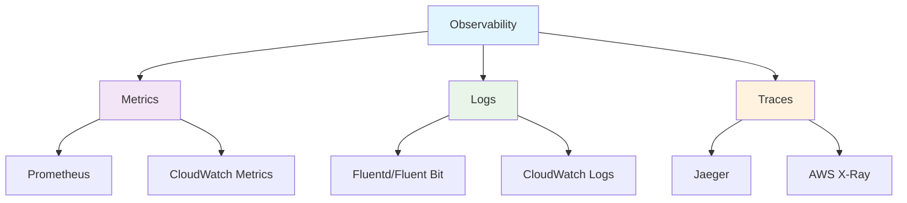

# 📊 監視とログ (Observability)

このガイドでは、Kubernetesクラスターとアプリケーションの監視、ログ、トレーシングについて学習します。AWS ECSでのCloudWatchの経験を活かしながら、Kubernetesの包括的な可視化ソリューションを理解します。

## 🎯 学習目標

- Observabilityの3つの柱（メトリクス、ログ、トレーシング）の理解
- Prometheus + Grafana による監視システムの構築
- ログ収集とアグリゲーションの実装
- AWS CloudWatch との統合方法

## 📚 Observability の基本概念

### 🔍 3つの柱



### 🎯 監視戦略

1. **インフラストラクチャ監視**: ノード、Pod、ネットワーク
2. **アプリケーション監視**: ビジネスメトリクス、パフォーマンス
3. **セキュリティ監視**: 異常検知、コンプライアンス
4. **コスト監視**: リソース使用量、最適化

## 📈 Metrics: Prometheus + Grafana

### 🔧 Prometheus の導入

```yaml
# Prometheus ConfigMap
apiVersion: v1
kind: ConfigMap
metadata:
  name: prometheus-config
  namespace: monitoring
data:
  prometheus.yml: |
    global:
      scrape_interval: 15s
      evaluation_interval: 15s
    
    rule_files:
      - "/etc/prometheus/rules/*.yml"
    
    alerting:
      alertmanagers:
        - static_configs:
            - targets:
              - alertmanager:9093
    
    scrape_configs:
    # Kubernetes API Server
    - job_name: 'kubernetes-apiservers'
      kubernetes_sd_configs:
      - role: endpoints
      relabel_configs:
      - source_labels: [__meta_kubernetes_namespace, __meta_kubernetes_service_name, __meta_kubernetes_endpoint_port_name]
        action: keep
        regex: default;kubernetes;https
    
    # Kubelet
    - job_name: 'kubernetes-nodes'
      kubernetes_sd_configs:
      - role: node
      relabel_configs:
      - action: labelmap
        regex: __meta_kubernetes_node_label_(.+)
    
    # Pod メトリクス
    - job_name: 'kubernetes-pods'
      kubernetes_sd_configs:
      - role: pod
      relabel_configs:
      - source_labels: [__meta_kubernetes_pod_annotation_prometheus_io_scrape]
        action: keep
        regex: true
      - source_labels: [__meta_kubernetes_pod_annotation_prometheus_io_path]
        action: replace
        target_label: __metrics_path__
        regex: (.+)
      - source_labels: [__address__, __meta_kubernetes_pod_annotation_prometheus_io_port]
        action: replace
        regex: ([^:]+)(?::\d+)?;(\d+)
        replacement: $1:$2
        target_label: __address__
    
    # アプリケーションサービス
    - job_name: 'web-app'
      static_configs:
      - targets: ['web-app-service:8080']
      metrics_path: '/metrics'
      scrape_interval: 30s

---
# Prometheus Deployment
apiVersion: apps/v1
kind: Deployment
metadata:
  name: prometheus
  namespace: monitoring
spec:
  replicas: 1
  selector:
    matchLabels:
      app: prometheus
  template:
    metadata:
      labels:
        app: prometheus
    spec:
      serviceAccountName: prometheus
      containers:
      - name: prometheus
        image: prom/prometheus:v2.40.0
        args:
          - '--config.file=/etc/prometheus/prometheus.yml'
          - '--storage.tsdb.path=/prometheus/'
          - '--web.console.libraries=/etc/prometheus/console_libraries'
          - '--web.console.templates=/etc/prometheus/consoles'
          - '--storage.tsdb.retention.time=30d'
          - '--web.enable-lifecycle'
        ports:
        - containerPort: 9090
        volumeMounts:
        - name: prometheus-config
          mountPath: /etc/prometheus/
        - name: prometheus-storage
          mountPath: /prometheus/
        
        resources:
          requests:
            memory: 1Gi
            cpu: 500m
          limits:
            memory: 2Gi
            cpu: 1000m
      
      volumes:
      - name: prometheus-config
        configMap:
          name: prometheus-config
      - name: prometheus-storage
        persistentVolumeClaim:
          claimName: prometheus-storage

---
# Prometheus Service
apiVersion: v1
kind: Service
metadata:
  name: prometheus-service
  namespace: monitoring
spec:
  selector:
    app: prometheus
  ports:
  - port: 9090
    targetPort: 9090
```

### 📊 Grafana ダッシュボード

```yaml
# Grafana Deployment
apiVersion: apps/v1
kind: Deployment
metadata:
  name: grafana
  namespace: monitoring
spec:
  replicas: 1
  selector:
    matchLabels:
      app: grafana
  template:
    metadata:
      labels:
        app: grafana
    spec:
      containers:
      - name: grafana
        image: grafana/grafana:9.3.0
        ports:
        - containerPort: 3000
        env:
        - name: GF_SECURITY_ADMIN_PASSWORD
          valueFrom:
            secretKeyRef:
              name: grafana-secret
              key: admin-password
        
        volumeMounts:
        - name: grafana-storage
          mountPath: /var/lib/grafana
        - name: grafana-datasources
          mountPath: /etc/grafana/provisioning/datasources
        - name: grafana-dashboards
          mountPath: /etc/grafana/provisioning/dashboards
        
        resources:
          requests:
            memory: 512Mi
            cpu: 200m
          limits:
            memory: 1Gi
            cpu: 500m
      
      volumes:
      - name: grafana-storage
        persistentVolumeClaim:
          claimName: grafana-storage
      - name: grafana-datasources
        configMap:
          name: grafana-datasources
      - name: grafana-dashboards
        configMap:
          name: grafana-dashboards

---
# Grafana データソース設定
apiVersion: v1
kind: ConfigMap
metadata:
  name: grafana-datasources
  namespace: monitoring
data:
  datasources.yaml: |
    apiVersion: 1
    datasources:
    - name: Prometheus
      type: prometheus
      access: proxy
      url: http://prometheus-service:9090
      isDefault: true
    
    - name: CloudWatch
      type: cloudwatch
      jsonData:
        authType: keys
        defaultRegion: us-west-2
      secureJsonData:
        accessKey: ${AWS_ACCESS_KEY_ID}
        secretKey: ${AWS_SECRET_ACCESS_KEY}

---
# Kubernetes クラスター監視ダッシュボード
apiVersion: v1
kind: ConfigMap
metadata:
  name: grafana-dashboards
  namespace: monitoring
data:
  dashboard-provider.yaml: |
    apiVersion: 1
    providers:
    - name: 'default'
      orgId: 1
      folder: ''
      type: file
      disableDeletion: false
      updateIntervalSeconds: 10
      options:
        path: /var/lib/grafana/dashboards
  
  cluster-overview.json: |
    {
      "dashboard": {
        "id": null,
        "title": "Kubernetes Cluster Overview",
        "panels": [
          {
            "title": "Cluster CPU Usage",
            "type": "stat",
            "targets": [
              {
                "expr": "sum(rate(container_cpu_usage_seconds_total[5m])) by (cluster)"
              }
            ]
          },
          {
            "title": "Memory Usage",
            "type": "stat",
            "targets": [
              {
                "expr": "sum(container_memory_usage_bytes) by (cluster)"
              }
            ]
          },
          {
            "title": "Pod Count",
            "type": "stat",
            "targets": [
              {
                "expr": "count(kube_pod_info)"
              }
            ]
          }
        ]
      }
    }
```

### 🚨 AlertManager 設定

```yaml
# AlertManager ConfigMap
apiVersion: v1
kind: ConfigMap
metadata:
  name: alertmanager-config
  namespace: monitoring
data:
  alertmanager.yml: |
    global:
      smtp_smarthost: 'smtp.gmail.com:587'
      smtp_from: 'alerts@example.com'
    
    route:
      group_by: ['alertname']
      group_wait: 10s
      group_interval: 10s
      repeat_interval: 1h
      receiver: 'web.hook'
      routes:
      - match:
          severity: critical
        receiver: 'critical-alerts'
      - match:
          severity: warning
        receiver: 'warning-alerts'
    
    receivers:
    - name: 'web.hook'
      webhook_configs:
      - url: 'http://slack-webhook-service:5000/alerts'
    
    - name: 'critical-alerts'
      email_configs:
      - to: 'oncall@example.com'
        subject: 'CRITICAL: {{ .GroupLabels.alertname }}'
        body: |
          {{ range .Alerts }}
          Alert: {{ .Annotations.summary }}
          Description: {{ .Annotations.description }}
          {{ end }}
      
      slack_configs:
      - api_url: 'https://hooks.slack.com/services/YOUR/SLACK/WEBHOOK'
        channel: '#alerts-critical'
        title: 'Critical Alert'
        text: '{{ range .Alerts }}{{ .Annotations.summary }}{{ end }}'
    
    - name: 'warning-alerts'
      slack_configs:
      - api_url: 'https://hooks.slack.com/services/YOUR/SLACK/WEBHOOK'
        channel: '#alerts-warning'
        title: 'Warning Alert'
        text: '{{ range .Alerts }}{{ .Annotations.summary }}{{ end }}'

---
# Prometheus アラートルール
apiVersion: v1
kind: ConfigMap
metadata:
  name: prometheus-rules
  namespace: monitoring
data:
  kubernetes.rules.yml: |
    groups:
    - name: kubernetes
      rules:
      # ノードの CPU 使用率が高い
      - alert: HighNodeCPU
        expr: 100 - (avg by(instance) (rate(node_cpu_seconds_total{mode="idle"}[5m])) * 100) > 80
        for: 5m
        labels:
          severity: warning
        annotations:
          summary: "High CPU usage on node {{ $labels.instance }}"
          description: "CPU usage is above 80% for more than 5 minutes"
      
      # メモリ使用率が高い
      - alert: HighMemoryUsage
        expr: (node_memory_MemTotal_bytes - node_memory_MemAvailable_bytes) / node_memory_MemTotal_bytes * 100 > 85
        for: 5m
        labels:
          severity: warning
        annotations:
          summary: "High memory usage on node {{ $labels.instance }}"
          description: "Memory usage is above 85%"
      
      # Pod が再起動を繰り返している
      - alert: PodCrashLooping
        expr: rate(kube_pod_container_status_restarts_total[15m]) > 0
        for: 5m
        labels:
          severity: critical
        annotations:
          summary: "Pod {{ $labels.pod }} is crash looping"
          description: "Pod has restarted more than 5 times in 15 minutes"
      
      # Deployment のレプリカ不足
      - alert: DeploymentReplicasMismatch
        expr: kube_deployment_spec_replicas != kube_deployment_status_available_replicas
        for: 5m
        labels:
          severity: warning
        annotations:
          summary: "Deployment {{ $labels.deployment }} has mismatched replicas"
          description: "Desired: {{ $value.kube_deployment_spec_replicas }}, Available: {{ $value.kube_deployment_status_available_replicas }}"
```

## 📝 Logs: 収集とアグリゲーション

### 🔧 Fluent Bit によるログ収集

```yaml
# Fluent Bit ConfigMap
apiVersion: v1
kind: ConfigMap
metadata:
  name: fluent-bit-config
  namespace: logging
data:
  fluent-bit.conf: |
    [SERVICE]
        Flush         1
        Log_Level     info
        Daemon        off
        Parsers_File  parsers.conf
        HTTP_Server   On
        HTTP_Listen   0.0.0.0
        HTTP_Port     2020
    
    [INPUT]
        Name              tail
        Path              /var/log/containers/*.log
        multiline.parser  docker, cri
        Tag               kube.*
        Mem_Buf_Limit     50MB
        Skip_Long_Lines   On
        Skip_Empty_Lines  On
    
    [FILTER]
        Name                kubernetes
        Match               kube.*
        Kube_URL            https://kubernetes.default.svc:443
        Kube_CA_File        /var/run/secrets/kubernetes.io/serviceaccount/ca.crt
        Kube_Token_File     /var/run/secrets/kubernetes.io/serviceaccount/token
        Kube_Tag_Prefix     kube.var.log.containers.
        Merge_Log           On
        Keep_Log            Off
        K8S-Logging.Parser  On
        K8S-Logging.Exclude On
    
    [FILTER]
        Name modify
        Match kube.*
        Add cluster_name production-cluster
        Add region us-west-2
    
    [OUTPUT]
        Name cloudwatch_logs
        Match kube.*
        region us-west-2
        log_group_name /aws/eks/production/cluster
        log_stream_prefix application-
        auto_create_group On
    
    [OUTPUT]
        Name es
        Match kube.*
        Host elasticsearch-service
        Port 9200
        Index kubernetes_logs
        Type _doc
        Include_Tag_Key On
        Tag_Key tag
        
  parsers.conf: |
    [PARSER]
        Name   apache
        Format regex
        Regex  ^(?<host>[^ ]*) [^ ]* (?<user>[^ ]*) \[(?<time>[^\]]*)\] "(?<method>\S+)(?: +(?<path>[^\"]*?)(?: +\S*)?)?" (?<code>[^ ]*) (?<size>[^ ]*)(?: "(?<referer>[^\"]*)" "(?<agent>[^\"]*)")?$
        Time_Key time
        Time_Format %d/%b/%Y:%H:%M:%S %z
    
    [PARSER]
        Name   json
        Format json
        Time_Key time
        Time_Format %Y-%m-%dT%H:%M:%S.%L

---
# Fluent Bit DaemonSet
apiVersion: apps/v1
kind: DaemonSet
metadata:
  name: fluent-bit
  namespace: logging
spec:
  selector:
    matchLabels:
      name: fluent-bit
  template:
    metadata:
      labels:
        name: fluent-bit
    spec:
      serviceAccountName: fluent-bit
      tolerations:
      - key: node-role.kubernetes.io/master
        operator: Exists
        effect: NoSchedule
      
      containers:
      - name: fluent-bit
        image: fluent/fluent-bit:2.0.8
        imagePullPolicy: Always
        ports:
        - containerPort: 2020
        
        env:
        - name: AWS_REGION
          value: "us-west-2"
        - name: CLUSTER_NAME
          value: "production-cluster"
        
        volumeMounts:
        - name: varlog
          mountPath: /var/log
        - name: varlibdockercontainers
          mountPath: /var/lib/docker/containers
          readOnly: true
        - name: fluent-bit-config
          mountPath: /fluent-bit/etc/
        
        resources:
          requests:
            cpu: 100m
            memory: 128Mi
          limits:
            cpu: 200m
            memory: 256Mi
      
      terminationGracePeriodSeconds: 10
      volumes:
      - name: varlog
        hostPath:
          path: /var/log
      - name: varlibdockercontainers
        hostPath:
          path: /var/lib/docker/containers
      - name: fluent-bit-config
        configMap:
          name: fluent-bit-config
```

### 📊 Elasticsearch + Kibana

```yaml
# Elasticsearch StatefulSet
apiVersion: apps/v1
kind: StatefulSet
metadata:
  name: elasticsearch
  namespace: logging
spec:
  serviceName: elasticsearch
  replicas: 3
  selector:
    matchLabels:
      app: elasticsearch
  template:
    metadata:
      labels:
        app: elasticsearch
    spec:
      containers:
      - name: elasticsearch
        image: docker.elastic.co/elasticsearch/elasticsearch:8.5.0
        ports:
        - containerPort: 9200
        - containerPort: 9300
        
        env:
        - name: cluster.name
          value: "kubernetes-logging"
        - name: node.name
          valueFrom:
            fieldRef:
              fieldPath: metadata.name
        - name: discovery.seed_hosts
          value: "elasticsearch-0.elasticsearch,elasticsearch-1.elasticsearch,elasticsearch-2.elasticsearch"
        - name: cluster.initial_master_nodes
          value: "elasticsearch-0,elasticsearch-1,elasticsearch-2"
        - name: ES_JAVA_OPTS
          value: "-Xms1g -Xmx1g"
        - name: xpack.security.enabled
          value: "false"
        
        volumeMounts:
        - name: elasticsearch-data
          mountPath: /usr/share/elasticsearch/data
        
        resources:
          requests:
            memory: 2Gi
            cpu: 500m
          limits:
            memory: 4Gi
            cpu: 1000m
  
  volumeClaimTemplates:
  - metadata:
      name: elasticsearch-data
    spec:
      accessModes: ["ReadWriteOnce"]
      storageClassName: gp3-ssd
      resources:
        requests:
          storage: 100Gi

---
# Kibana Deployment
apiVersion: apps/v1
kind: Deployment
metadata:
  name: kibana
  namespace: logging
spec:
  replicas: 1
  selector:
    matchLabels:
      app: kibana
  template:
    metadata:
      labels:
        app: kibana
    spec:
      containers:
      - name: kibana
        image: docker.elastic.co/kibana/kibana:8.5.0
        ports:
        - containerPort: 5601
        
        env:
        - name: ELASTICSEARCH_HOSTS
          value: "http://elasticsearch-service:9200"
        - name: SERVER_NAME
          value: "kibana"
        - name: SERVER_HOST
          value: "0.0.0.0"
        
        resources:
          requests:
            memory: 1Gi
            cpu: 200m
          limits:
            memory: 2Gi
            cpu: 500m
```

## 🔍 Distributed Tracing

### 🕸️ Jaeger 導入

```yaml
# Jaeger All-in-One
apiVersion: apps/v1
kind: Deployment
metadata:
  name: jaeger
  namespace: tracing
spec:
  replicas: 1
  selector:
    matchLabels:
      app: jaeger
  template:
    metadata:
      labels:
        app: jaeger
    spec:
      containers:
      - name: jaeger
        image: jaegertracing/all-in-one:1.38
        ports:
        - containerPort: 16686  # UI
        - containerPort: 14268  # HTTP collector
        - containerPort: 6831   # UDP agent
        - containerPort: 6832   # UDP agent
        
        env:
        - name: COLLECTOR_ZIPKIN_HOST_PORT
          value: ":9411"
        - name: SPAN_STORAGE_TYPE
          value: "elasticsearch"
        - name: ES_SERVER_URLS
          value: "http://elasticsearch-service.logging:9200"
        
        resources:
          requests:
            memory: 512Mi
            cpu: 200m
          limits:
            memory: 1Gi
            cpu: 500m

---
# アプリケーションでのトレーシング設定例
apiVersion: apps/v1
kind: Deployment
metadata:
  name: traced-web-app
spec:
  template:
    spec:
      containers:
      - name: web-app
        image: myapp:latest
        env:
        # Jaeger Agent エンドポイント
        - name: JAEGER_AGENT_HOST
          value: "jaeger-service"
        - name: JAEGER_AGENT_PORT
          value: "6831"
        - name: JAEGER_SERVICE_NAME
          value: "web-app"
        - name: JAEGER_SAMPLER_TYPE
          value: "const"
        - name: JAEGER_SAMPLER_PARAM
          value: "1"
```

## 🔧 アプリケーションレベルの監視

### 📊 カスタムメトリクス

```yaml
# アプリケーションでのPrometheusメトリクス公開
apiVersion: apps/v1
kind: Deployment
metadata:
  name: monitored-app
  namespace: production
spec:
  template:
    metadata:
      annotations:
        prometheus.io/scrape: "true"
        prometheus.io/port: "8080"
        prometheus.io/path: "/metrics"
    spec:
      containers:
      - name: app
        image: myapp:latest
        ports:
        - containerPort: 8080
          name: http
        - containerPort: 9090
          name: metrics
        
        # アプリケーションメトリクス用環境変数
        env:
        - name: METRICS_ENABLED
          value: "true"
        - name: METRICS_PORT
          value: "9090"
        
        # ヘルスチェック
        livenessProbe:
          httpGet:
            path: /health
            port: 8080
          initialDelaySeconds: 30
          periodSeconds: 10
        
        readinessProbe:
          httpGet:
            path: /ready
            port: 8080
          initialDelaySeconds: 5
          periodSeconds: 5
```

### 📈 ビジネスメトリクス

```yaml
# カスタムメトリクス用ServiceMonitor
apiVersion: monitoring.coreos.com/v1
kind: ServiceMonitor
metadata:
  name: business-metrics
  namespace: production
spec:
  selector:
    matchLabels:
      app: web-app
  endpoints:
  - port: metrics
    interval: 30s
    path: /metrics

---
# PrometheusRule for ビジネスアラート
apiVersion: monitoring.coreos.com/v1
kind: PrometheusRule
metadata:
  name: business-alerts
  namespace: production
spec:
  groups:
  - name: business
    rules:
    # レスポンス時間が遅い
    - alert: HighResponseTime
      expr: histogram_quantile(0.95, sum(rate(http_request_duration_seconds_bucket[5m])) by (le)) > 0.5
      for: 5m
      labels:
        severity: warning
      annotations:
        summary: "High response time detected"
        description: "95th percentile response time is above 500ms"
    
    # エラー率が高い
    - alert: HighErrorRate
      expr: sum(rate(http_requests_total{status=~"5.."}[5m])) / sum(rate(http_requests_total[5m])) > 0.05
      for: 2m
      labels:
        severity: critical
      annotations:
        summary: "High error rate detected"
        description: "Error rate is above 5%"
    
    # ビジネス指標: 注文数の急激な減少
    - alert: OrderRateDropped
      expr: rate(orders_total[5m]) < 0.1 * rate(orders_total[1h] offset 1h)
      for: 10m
      labels:
        severity: warning
      annotations:
        summary: "Order rate significantly dropped"
        description: "Current order rate is less than 10% of the rate 1 hour ago"
```

## 🆚 AWS ECS vs Kubernetes 監視比較

| 監視項目 | AWS ECS | Kubernetes | 備考 |
|----------|---------|------------|------|
| **メトリクス** | CloudWatch Metrics | Prometheus + Grafana | K8sでより柔軟なカスタマイズ |
| **ログ** | CloudWatch Logs | Fluent Bit + ELK | K8sで構造化ログ処理が容易 |
| **トレーシング** | AWS X-Ray | Jaeger/Zipkin | K8sでオープンソース選択肢 |
| **ダッシュボード** | CloudWatch Dashboard | Grafana | Grafanaの方が表現力豊富 |
| **アラート** | CloudWatch Alarms | AlertManager | K8sでより詳細なルール設定 |
| **コスト** | 従量課金 | インフラコスト | 長期的にはK8sが安価 |
| **統合** | AWS統合 | プラグイン豊富 | K8sで多様なツール連携 |

## 🛠️ 実践的な監視構成

### 1. 本番環境監視スタック

```yaml
# 監視名前空間
apiVersion: v1
kind: Namespace
metadata:
  name: monitoring
  labels:
    name: monitoring

---
# Prometheus Operator
apiVersion: v1
kind: ServiceAccount
metadata:
  name: prometheus-operator
  namespace: monitoring

---
apiVersion: rbac.authorization.k8s.io/v1
kind: ClusterRole
metadata:
  name: prometheus-operator
rules:
- apiGroups: [""]
  resources: ["*"]
  verbs: ["*"]
- apiGroups: ["monitoring.coreos.com"]
  resources: ["*"]
  verbs: ["*"]

---
apiVersion: rbac.authorization.k8s.io/v1
kind: ClusterRoleBinding
metadata:
  name: prometheus-operator
roleRef:
  apiGroup: rbac.authorization.k8s.io
  kind: ClusterRole
  name: prometheus-operator
subjects:
- kind: ServiceAccount
  name: prometheus-operator
  namespace: monitoring

---
# Prometheus インスタンス
apiVersion: monitoring.coreos.com/v1
kind: Prometheus
metadata:
  name: main
  namespace: monitoring
spec:
  serviceAccountName: prometheus
  serviceMonitorSelector:
    matchLabels:
      prometheus: main
  ruleSelector:
    matchLabels:
      prometheus: main
  
  storage:
    volumeClaimTemplate:
      spec:
        accessModes: ["ReadWriteOnce"]
        storageClassName: gp3-ssd
        resources:
          requests:
            storage: 100Gi
  
  retention: 30d
  
  resources:
    requests:
      memory: 2Gi
      cpu: 500m
    limits:
      memory: 4Gi
      cpu: 1000m
  
  alerting:
    alertmanagers:
    - namespace: monitoring
      name: main
      port: web
```

### 2. SLI/SLO監視

```yaml
# SLI/SLO定義
apiVersion: v1
kind: ConfigMap
metadata:
  name: slo-definitions
  namespace: monitoring
data:
  slo.yml: |
    slos:
    - name: "api-availability"
      description: "API should be available 99.9% of the time"
      target: 0.999
      query: |
        sum(rate(http_requests_total{job="api-service",code!~"5.."}[5m])) /
        sum(rate(http_requests_total{job="api-service"}[5m]))
    
    - name: "response-time"
      description: "95% of requests should be under 500ms"
      target: 0.95
      query: |
        histogram_quantile(0.95,
          sum(rate(http_request_duration_seconds_bucket{job="api-service"}[5m])) by (le)
        ) < 0.5

---
# SLO アラート
apiVersion: monitoring.coreos.com/v1
kind: PrometheusRule
metadata:
  name: slo-alerts
  namespace: monitoring
spec:
  groups:
  - name: slo
    rules:
    # エラーバジェット燃焼率
    - alert: ErrorBudgetBurnRate
      expr: |
        (
          1 - (
            sum(rate(http_requests_total{code!~"5.."}[1h])) /
            sum(rate(http_requests_total[1h]))
          )
        ) > 0.001 * 14.4  # 14.4倍の燃焼率
      for: 2m
      labels:
        severity: critical
      annotations:
        summary: "Error budget burning too fast"
        description: "At current rate, error budget will be exhausted in 6 hours"
```

## 🛠️ トラブルシューティング

### よくある監視問題と解決方法

#### 1. メトリクスが収集されない

```bash
# Prometheus targets 確認
kubectl port-forward -n monitoring svc/prometheus-service 9090:9090
# http://localhost:9090/targets でTarget状態確認

# ServiceMonitor 確認
kubectl get servicemonitor -n production

# Pod のメトリクスエンドポイント確認
kubectl exec -it web-app-123 -- curl localhost:8080/metrics
```

#### 2. ログが表示されない

```bash
# Fluent Bit の状態確認
kubectl get pods -n logging
kubectl logs -n logging daemonset/fluent-bit

# CloudWatch ロググループ確認
aws logs describe-log-groups --log-group-name-prefix /aws/eks

# Pod ログの直接確認
kubectl logs web-app-123 --previous
```

#### 3. アラートが発火しない

```bash
# AlertManager 設定確認
kubectl get prometheusrule -n monitoring
kubectl describe prometheusrule business-alerts -n monitoring

# アラートルール評価確認
# Prometheus UI -> Alerts でルール状態確認

# AlertManager 設定確認
kubectl logs -n monitoring deployment/alertmanager
```

## 🎯 学習チェック

### 理解度確認クイズ

<details>
<summary>Q1: PrometheusとCloudWatchの使い分けは？</summary>

**A**: 
- **Prometheus**: アプリケーションメトリクス、カスタムメトリクス、詳細なアラート
- **CloudWatch**: AWSリソースメトリクス、長期保存、AWSサービス統合

両方を組み合わせて包括的な監視を構築します。
</details>

<details>
<summary>Q2: ログとメトリクスの違いと使い分けは？</summary>

**A**: 
- **メトリクス**: 数値データ、傾向分析、アラート向け
- **ログ**: 詳細な情報、トラブルシューティング、監査向け

メトリクスで異常を検知し、ログで詳細を調査します。
</details>

<details>
<summary>Q3: SLI/SLOベースの監視の利点は？</summary>

**A**: 
- **ユーザー中心**: 実際のユーザー体験を測定
- **ビジネス整合**: ビジネス目標と技術指標の連携
- **プロアクティブ**: 問題が発生する前に対応

技術中心ではなく、ビジネス価値に基づいた監視が可能です。
</details>

## 🔗 次のステップ

監視とログを理解したら、次は以下を学習してください：

1. **[スケーリングとオートメーション](./scaling-automation.md)** - メトリクスベースの自動スケーリング
2. **[実践チュートリアル](../../tutorials/observability/)** - 監視システムの構築実践
3. **[ハンズオンラボ](../../hands-on-labs/monitoring-logging/)** - 包括的な監視演習

## 📚 参考資料

- [Prometheus Documentation](https://prometheus.io/docs/)
- [Grafana Documentation](https://grafana.com/docs/)
- [Fluent Bit Documentation](https://docs.fluentbit.io/)
- [Jaeger Documentation](https://www.jaegertracing.io/docs/)
- [AWS Container Insights](https://docs.aws.amazon.com/AmazonCloudWatch/latest/monitoring/ContainerInsights.html)

---

**前へ**: [ネットワーキング](./networking.md) | **次へ**: [スケーリングとオートメーション](./scaling-automation.md)
