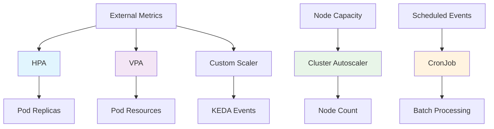

# 🔄 スケーリングとオートメーション (Scaling & Automation)

このガイドでは、Kubernetesにおける動的スケーリングと自動化機能について学習します。AWS ECSでのAuto Scalingの経験を活かしながら、Kubernetesのより柔軟で高度なスケーリングメカニズムを理解します。

## 🎯 学習目標

- HPA、VPA、Cluster Autoscalerの理解と使い分け
- カスタムメトリクスベースのスケーリング実装
- スケジュールベースとイベントドリブンなオートメーション
- AWS ECSとの比較とベストプラクティス

## 📚 Kubernetesスケーリングの基本概念

### 🏗️ スケーリングアーキテクチャ



### 🔄 スケーリングの種類

1. **Horizontal Scaling**: Pod数の増減（HPA）
2. **Vertical Scaling**: Pod当たりのリソース調整（VPA）
3. **Cluster Scaling**: ノード数の増減（CA）
4. **Event-Driven Scaling**: イベントベーススケーリング（KEDA）

## 📈 Horizontal Pod Autoscaler (HPA)

### 🔧 基本的なHPA設定

```yaml
# CPU使用率ベースのHPA
apiVersion: autoscaling/v2
kind: HorizontalPodAutoscaler
metadata:
  name: web-app-hpa
  namespace: production
spec:
  scaleTargetRef:
    apiVersion: apps/v1
    kind: Deployment
    name: web-app
  
  minReplicas: 3
  maxReplicas: 50
  
  metrics:
  # CPU使用率（平均70%で維持）
  - type: Resource
    resource:
      name: cpu
      target:
        type: Utilization
        averageUtilization: 70
  
  # メモリ使用率
  - type: Resource
    resource:
      name: memory
      target:
        type: Utilization
        averageUtilization: 80
  
  # スケーリング動作の設定
  behavior:
    scaleUp:
      stabilizationWindowSeconds: 60
      policies:
      - type: Percent
        value: 100  # 最大100%増加
        periodSeconds: 60
      - type: Pods
        value: 5    # 最大5Pod増加
        periodSeconds: 60
    
    scaleDown:
      stabilizationWindowSeconds: 300  # 5分間の安定期間
      policies:
      - type: Percent
        value: 10   # 最大10%減少
        periodSeconds: 60

---
# 対象Deployment
apiVersion: apps/v1
kind: Deployment
metadata:
  name: web-app
  namespace: production
spec:
  replicas: 3  # HPAが管理するため初期値
  selector:
    matchLabels:
      app: web-app
  template:
    metadata:
      labels:
        app: web-app
    spec:
      containers:
      - name: web-app
        image: myapp:latest
        ports:
        - containerPort: 8080
        
        # リソース制限（HPA計算に必要）
        resources:
          requests:
            cpu: 200m
            memory: 256Mi
          limits:
            cpu: 500m
            memory: 512Mi
        
        # ヘルスチェック
        livenessProbe:
          httpGet:
            path: /health
            port: 8080
          initialDelaySeconds: 30
          periodSeconds: 10
        
        readinessProbe:
          httpGet:
            path: /ready
            port: 8080
          initialDelaySeconds: 5
          periodSeconds: 5
```

### 📊 カスタムメトリクスHPA

```yaml
# Prometheus メトリクスベースのHPA
apiVersion: autoscaling/v2
kind: HorizontalPodAutoscaler
metadata:
  name: api-custom-hpa
  namespace: production
spec:
  scaleTargetRef:
    apiVersion: apps/v1
    kind: Deployment
    name: api-service
  
  minReplicas: 2
  maxReplicas: 20
  
  metrics:
  # CPU（基本メトリクス）
  - type: Resource
    resource:
      name: cpu
      target:
        type: Utilization
        averageUtilization: 60
  
  # カスタムメトリクス: リクエスト数
  - type: Pods
    pods:
      metric:
        name: http_requests_per_second
      target:
        type: AverageValue
        averageValue: "100"  # 1秒あたり100リクエスト/Pod
  
  # 外部メトリクス: SQSキュー長
  - type: External
    external:
      metric:
        name: sqs_queue_length
        selector:
          matchLabels:
            queue_name: "processing-queue"
      target:
        type: AverageValue
        averageValue: "10"  # キューに10メッセージ/Pod

---
# Prometheus Adapter設定
apiVersion: v1
kind: ConfigMap
metadata:
  name: adapter-config
  namespace: monitoring
data:
  config.yaml: |
    rules:
    # HTTP リクエスト数メトリクス
    - seriesQuery: 'http_requests_total{namespace!="",pod!=""}'
      resources:
        overrides:
          namespace: {resource: "namespace"}
          pod: {resource: "pod"}
      name:
        matches: "^http_requests_total"
        as: "http_requests_per_second"
      metricsQuery: 'sum(rate(<<.Series>>{<<.LabelMatchers>>}[2m])) by (<<.GroupBy>>)'
    
    # SQS キュー長（CloudWatch経由）
    - seriesQuery: 'cloudwatch_sqs_approximate_number_of_messages{queue_name!=""}'
      name:
        matches: "^cloudwatch_sqs_approximate_number_of_messages"
        as: "sqs_queue_length"
      metricsQuery: 'sum(<<.Series>>{<<.LabelMatchers>>}) by (<<.GroupBy>>)'
```

### 🎯 予測的スケーリング

```yaml
# 時間ベースの予測スケーリング
apiVersion: batch/v1
kind: CronJob
metadata:
  name: predictive-scaling
  namespace: production
spec:
  schedule: "*/5 * * * *"  # 5分ごと
  jobTemplate:
    spec:
      template:
        spec:
          containers:
          - name: scaler
            image: kubectl:latest
            command: ["/bin/bash"]
            args:
            - -c
            - |
              HOUR=$(date +%H)
              DAY=$(date +%u)
              
              # 平日のピーク時間（9-18時）
              if [[ $DAY -le 5 && $HOUR -ge 9 && $HOUR -le 18 ]]; then
                MIN_REPLICAS=10
                MAX_REPLICAS=50
              # 夜間・週末
              else
                MIN_REPLICAS=3
                MAX_REPLICAS=20
              fi
              
              # HPA設定を更新
              kubectl patch hpa web-app-hpa -n production --type='merge' -p="{
                \"spec\": {
                  \"minReplicas\": $MIN_REPLICAS,
                  \"maxReplicas\": $MAX_REPLICAS
                }
              }"
          
          restartPolicy: OnFailure
          serviceAccountName: scaler-sa
```

## 📏 Vertical Pod Autoscaler (VPA)

### 🔧 VPA設定

```yaml
# VPA基本設定
apiVersion: autoscaling.k8s.io/v1
kind: VerticalPodAutoscaler
metadata:
  name: database-vpa
  namespace: production
spec:
  targetRef:
    apiVersion: apps/v1
    kind: StatefulSet
    name: postgres
  
  updatePolicy:
    updateMode: "Auto"  # Auto, Off, Initial
  
  resourcePolicy:
    containerPolicies:
    - containerName: postgres
      # 最小リソース
      minAllowed:
        cpu: 500m
        memory: 1Gi
      
      # 最大リソース
      maxAllowed:
        cpu: 4000m
        memory: 8Gi
      
      # 制御対象リソース
      controlledResources: ["cpu", "memory"]
      
      # スケーリングモード
      mode: Auto  # Auto, Off

---
# 推奨値のみ確認（実際には適用しない）
apiVersion: autoscaling.k8s.io/v1
kind: VerticalPodAutoscaler
metadata:
  name: web-app-vpa-recommendation
  namespace: production
spec:
  targetRef:
    apiVersion: apps/v1
    kind: Deployment
    name: web-app
  
  updatePolicy:
    updateMode: "Off"  # 推奨値のみ生成

---
# VPA推奨値確認コマンド
# kubectl describe vpa web-app-vpa-recommendation -n production
```

### 🔄 VPAとHPAの組み合わせ

```yaml
# VPA（CPU）+ HPA（メモリ）の組み合わせ
apiVersion: autoscaling.k8s.io/v1
kind: VerticalPodAutoscaler
metadata:
  name: api-service-vpa
  namespace: production
spec:
  targetRef:
    apiVersion: apps/v1
    kind: Deployment
    name: api-service
  
  updatePolicy:
    updateMode: Auto
  
  resourcePolicy:
    containerPolicies:
    - containerName: api-service
      controlledResources: ["cpu"]  # CPUのみVPAで制御
      minAllowed:
        cpu: 100m
      maxAllowed:
        cpu: 2000m

---
# メモリ使用量ベースのHPA（VPAと併用）
apiVersion: autoscaling/v2
kind: HorizontalPodAutoscaler
metadata:
  name: api-service-hpa
  namespace: production
spec:
  scaleTargetRef:
    apiVersion: apps/v1
    kind: Deployment
    name: api-service
  
  minReplicas: 2
  maxReplicas: 20
  
  metrics:
  - type: Resource
    resource:
      name: memory
      target:
        type: Utilization
        averageUtilization: 70
```

## 🏗️ Cluster Autoscaler

### ⚙️ Cluster Autoscaler設定

```yaml
# Cluster Autoscaler Deployment
apiVersion: apps/v1
kind: Deployment
metadata:
  name: cluster-autoscaler
  namespace: kube-system
spec:
  replicas: 1
  selector:
    matchLabels:
      app: cluster-autoscaler
  template:
    metadata:
      labels:
        app: cluster-autoscaler
      annotations:
        prometheus.io/scrape: 'true'
        prometheus.io/port: '8085'
    spec:
      serviceAccountName: cluster-autoscaler
      containers:
      - name: cluster-autoscaler
        image: k8s.gcr.io/autoscaling/cluster-autoscaler:v1.24.0
        command:
        - ./cluster-autoscaler
        - --v=4
        - --stderrthreshold=info
        - --cloud-provider=aws
        - --skip-nodes-with-local-storage=false
        - --expander=least-waste
        - --node-group-auto-discovery=asg:tag=k8s.io/cluster-autoscaler/enabled,k8s.io/cluster-autoscaler/production-cluster
        - --balance-similar-node-groups
        - --skip-nodes-with-system-pods=false
        - --scale-down-delay-after-add=10m
        - --scale-down-unneeded-time=10m
        - --scale-down-delay-after-delete=10s
        - --scale-down-delay-after-failure=3m
        - --scale-down-utilization-threshold=0.5
        - --max-node-provision-time=15m
        
        env:
        - name: AWS_REGION
          value: us-west-2
        
        resources:
          requests:
            cpu: 100m
            memory: 300Mi
          limits:
            cpu: 100m
            memory: 300Mi
        
        volumeMounts:
        - name: ssl-certs
          mountPath: /etc/ssl/certs/ca-certificates.crt
          readOnly: true
      
      volumes:
      - name: ssl-certs
        hostPath:
          path: /etc/ssl/certs/ca-certificates.crt
      
      tolerations:
      - effect: NoSchedule
        key: node-role.kubernetes.io/master

---
# ServiceAccount とRBAC
apiVersion: v1
kind: ServiceAccount
metadata:
  name: cluster-autoscaler
  namespace: kube-system
  annotations:
    eks.amazonaws.com/role-arn: arn:aws:iam::ACCOUNT:role/ClusterAutoscalerRole

---
apiVersion: rbac.authorization.k8s.io/v1
kind: ClusterRole
metadata:
  name: cluster-autoscaler
rules:
- apiGroups: [""]
  resources: ["events", "endpoints"]
  verbs: ["create", "patch"]
- apiGroups: [""]
  resources: ["pods/eviction"]
  verbs: ["create"]
- apiGroups: [""]
  resources: ["pods/status"]
  verbs: ["update"]
- apiGroups: [""]
  resources: ["endpoints"]
  resourceNames: ["cluster-autoscaler"]
  verbs: ["get", "update"]
- apiGroups: [""]
  resources: ["nodes"]
  verbs: ["watch", "list", "get", "update"]
- apiGroups: [""]
  resources: ["pods", "services", "replicationcontrollers", "persistentvolumeclaims", "persistentvolumes"]
  verbs: ["watch", "list", "get"]
- apiGroups: ["extensions"]
  resources: ["replicasets", "daemonsets"]
  verbs: ["watch", "list", "get"]
- apiGroups: ["policy"]
  resources: ["poddisruptionbudgets"]
  verbs: ["watch", "list"]
- apiGroups: ["apps"]
  resources: ["statefulsets", "replicasets", "daemonsets"]
  verbs: ["watch", "list", "get"]
- apiGroups: ["storage.k8s.io"]
  resources: ["storageclasses", "csinodes"]
  verbs: ["watch", "list", "get"]
- apiGroups: ["batch", "extensions"]
  resources: ["jobs"]
  verbs: ["get", "list", "watch", "patch"]
- apiGroups: ["coordination.k8s.io"]
  resources: ["leases"]
  verbs: ["create"]
- apiGroups: ["coordination.k8s.io"]
  resourceNames: ["cluster-autoscaler"]
  resources: ["leases"]
  verbs: ["get", "update"]
```

### 🎯 ノードグループ戦略

```yaml
# 複数ノードグループでの効率的スケーリング
# Terraform/CloudFormation でのEKS Node Group設定例

# 汎用ワークロード用（burstable instances）
resource "aws_eks_node_group" "general" {
  cluster_name    = aws_eks_cluster.main.name
  node_group_name = "general"
  node_role_arn   = aws_iam_role.node_group.arn
  subnet_ids      = var.private_subnet_ids
  
  instance_types = ["t3.medium", "t3.large", "t3.xlarge"]
  capacity_type  = "SPOT"  # コスト削減
  
  scaling_config {
    desired_size = 3
    max_size     = 20
    min_size     = 0
  }
  
  tags = {
    "k8s.io/cluster-autoscaler/enabled" = "true"
    "k8s.io/cluster-autoscaler/production-cluster" = "owned"
    "k8s.io/cluster-autoscaler/node-template/label/workload-type" = "general"
  }
}

# CPU集約的ワークロード用
resource "aws_eks_node_group" "cpu_intensive" {
  cluster_name    = aws_eks_cluster.main.name
  node_group_name = "cpu-intensive"
  node_role_arn   = aws_iam_role.node_group.arn
  subnet_ids      = var.private_subnet_ids
  
  instance_types = ["c5.large", "c5.xlarge", "c5.2xlarge"]
  capacity_type  = "ON_DEMAND"
  
  scaling_config {
    desired_size = 0
    max_size     = 10
    min_size     = 0
  }
  
  tags = {
    "k8s.io/cluster-autoscaler/enabled" = "true"
    "k8s.io/cluster-autoscaler/production-cluster" = "owned"
    "k8s.io/cluster-autoscaler/node-template/label/workload-type" = "cpu-intensive"
  }
}

# 対応するPod配置
apiVersion: apps/v1
kind: Deployment
metadata:
  name: cpu-intensive-app
spec:
  template:
    spec:
      nodeSelector:
        workload-type: cpu-intensive
      
      containers:
      - name: app
        image: cpu-intensive-app:latest
        resources:
          requests:
            cpu: 2000m
            memory: 2Gi
          limits:
            cpu: 4000m
            memory: 4Gi
```

## 🎛️ KEDA: Event-Driven Autoscaling

### 🔧 KEDA による イベントドリブンスケーリング

```yaml
# KEDA ScaledObject（SQSベース）
apiVersion: keda.sh/v1alpha1
kind: ScaledObject
metadata:
  name: sqs-scaler
  namespace: processing
spec:
  scaleTargetRef:
    name: message-processor
  
  minReplicaCount: 0    # ゼロスケーリング対応
  maxReplicaCount: 100
  
  triggers:
  # SQS キュー長ベース
  - type: aws-sqs-queue
    metadata:
      queueURL: https://sqs.us-west-2.amazonaws.com/ACCOUNT/processing-queue
      queueLength: "10"  # キューに10メッセージあたり1Pod
      awsRegion: us-west-2
    authenticationRef:
      name: aws-credentials

---
# RabbitMQ ベーススケーリング
apiVersion: keda.sh/v1alpha1
kind: ScaledObject
metadata:
  name: rabbitmq-scaler
  namespace: processing
spec:
  scaleTargetRef:
    name: queue-consumer
  
  triggers:
  - type: rabbitmq
    metadata:
      host: amqp://rabbitmq-service:5672
      queueName: work-queue
      queueLength: "5"

---
# Prometheus メトリクスベース
apiVersion: keda.sh/v1alpha1
kind: ScaledObject
metadata:
  name: prometheus-scaler
  namespace: production
spec:
  scaleTargetRef:
    name: api-service
  
  triggers:
  - type: prometheus
    metadata:
      serverAddress: http://prometheus-service:9090
      metricName: http_requests_per_second
      threshold: "100"
      query: sum(rate(http_requests_total{job="api-service"}[1m]))

---
# Cron スケジュールベース
apiVersion: keda.sh/v1alpha1
kind: ScaledObject
metadata:
  name: scheduled-scaler
  namespace: batch
spec:
  scaleTargetRef:
    name: batch-processor
  
  triggers:
  - type: cron
    metadata:
      timezone: Asia/Tokyo
      start: "0 9 * * 1-5"   # 平日9時開始
      end: "0 18 * * 1-5"    # 平日18時終了
      desiredReplicas: "10"
```

## 📅 スケジュールベースオートメーション

### ⏰ CronJob による定期処理

```yaml
# 日次レポート生成
apiVersion: batch/v1
kind: CronJob
metadata:
  name: daily-report
  namespace: analytics
spec:
  schedule: "0 6 * * *"  # 毎日午前6時
  timeZone: "Asia/Tokyo"
  
  jobTemplate:
    spec:
      template:
        spec:
          containers:
          - name: report-generator
            image: analytics/report-generator:latest
            command: ["/app/generate_daily_report.sh"]
            
            env:
            - name: REPORT_DATE
              value: "$(date -d 'yesterday' +%Y-%m-%d)"
            - name: S3_BUCKET
              value: "analytics-reports"
            
            resources:
              requests:
                cpu: 500m
                memory: 1Gi
              limits:
                cpu: 1000m
                memory: 2Gi
          
          restartPolicy: OnFailure
      
      backoffLimit: 3
      activeDeadlineSeconds: 3600  # 1時間でタイムアウト

---
# 週次データ処理
apiVersion: batch/v1
kind: CronJob
metadata:
  name: weekly-data-processing
  namespace: analytics
spec:
  schedule: "0 2 * * 0"  # 毎週日曜日午前2時
  
  jobTemplate:
    spec:
      parallelism: 5  # 並列処理数
      completions: 5
      
      template:
        spec:
          containers:
          - name: data-processor
            image: analytics/data-processor:latest
            
            env:
            - name: WORKER_ID
              valueFrom:
                fieldRef:
                  fieldPath: metadata.name
            - name: TOTAL_WORKERS
              value: "5"
          
          restartPolicy: OnFailure

---
# スケール調整用CronJob
apiVersion: batch/v1
kind: CronJob
metadata:
  name: scale-adjustment
  namespace: production
spec:
  schedule: "*/15 * * * *"  # 15分ごと
  
  jobTemplate:
    spec:
      template:
        spec:
          serviceAccountName: scale-adjuster
          containers:
          - name: scaler
            image: kubectl:latest
            command: ["/bin/bash"]
            args:
            - -c
            - |
              # 現在の負荷状況を取得
              CPU_USAGE=$(kubectl top nodes --no-headers | awk '{sum+=$3} END {print sum/NR}' | cut -d'%' -f1)
              
              # 負荷に応じてスケール調整
              if [ ${CPU_USAGE%.*} -gt 80 ]; then
                echo "High CPU usage detected, scaling up"
                kubectl patch hpa web-app-hpa --type='merge' -p='{"spec":{"minReplicas":10}}'
              elif [ ${CPU_USAGE%.*} -lt 30 ]; then
                echo "Low CPU usage detected, scaling down"
                kubectl patch hpa web-app-hpa --type='merge' -p='{"spec":{"minReplicas":3}}'
              fi
          
          restartPolicy: OnFailure
```

## 🆚 AWS ECS vs Kubernetes スケーリング比較

| スケーリング種類 | AWS ECS | Kubernetes | 特徴・利点 |
|------------------|---------|------------|------------|
| **Pod/Task数** | Service Auto Scaling | HPA | K8sでより細かい制御 |
| **リソース調整** | 手動/サードパーティ | VPA | K8sで自動リソース最適化 |
| **クラスター拡張** | ASG Auto Scaling | Cluster Autoscaler | 同様の仕組み |
| **イベント駆動** | Lambda + EventBridge | KEDA | K8sで統合的な仕組み |
| **スケジュール** | EventBridge Rules | CronJob | K8sでネイティブサポート |
| **カスタムメトリクス** | CloudWatch + Custom | Prometheus + HPA | K8sで柔軟性が高い |
| **予測スケーリング** | EC2 Predictive Scaling | カスタム実装 | ECSで標準サポート |
| **コスト最適化** | Spot Fleet | Spot Instances + CA | 両方とも対応 |

## 🔧 実践的なスケーリング戦略

### 1. 段階的スケーリング戦略

```yaml
# 段階1: 基本HPA
apiVersion: autoscaling/v2
kind: HorizontalPodAutoscaler
metadata:
  name: web-app-basic-hpa
  namespace: production
spec:
  scaleTargetRef:
    apiVersion: apps/v1
    kind: Deployment
    name: web-app
  
  minReplicas: 3
  maxReplicas: 10  # 最初は控えめ
  
  metrics:
  - type: Resource
    resource:
      name: cpu
      target:
        type: Utilization
        averageUtilization: 70

---
# 段階2: 高度な動作制御
apiVersion: autoscaling/v2
kind: HorizontalPodAutoscaler
metadata:
  name: web-app-advanced-hpa
  namespace: production
spec:
  scaleTargetRef:
    apiVersion: apps/v1
    kind: Deployment
    name: web-app
  
  minReplicas: 5
  maxReplicas: 50
  
  metrics:
  - type: Resource
    resource:
      name: cpu
      target:
        type: Utilization
        averageUtilization: 70
  
  - type: Pods
    pods:
      metric:
        name: http_requests_per_second
      target:
        type: AverageValue
        averageValue: "100"
  
  behavior:
    scaleUp:
      stabilizationWindowSeconds: 60
      policies:
      - type: Percent
        value: 50
        periodSeconds: 60
      - type: Pods
        value: 3
        periodSeconds: 60
    
    scaleDown:
      stabilizationWindowSeconds: 300
      policies:
      - type: Percent
        value: 10
        periodSeconds: 60
```

### 2. マルチレイヤースケーリング

```yaml
# アプリケーション層のスケーリング
apiVersion: autoscaling/v2
kind: HorizontalPodAutoscaler
metadata:
  name: frontend-hpa
  namespace: web
spec:
  scaleTargetRef:
    apiVersion: apps/v1
    kind: Deployment
    name: frontend
  
  minReplicas: 3
  maxReplicas: 20
  
  metrics:
  - type: Resource
    resource:
      name: cpu
      target:
        type: Utilization
        averageUtilization: 60

---
# API層のスケーリング
apiVersion: autoscaling/v2
kind: HorizontalPodAutoscaler
metadata:
  name: api-hpa
  namespace: api
spec:
  scaleTargetRef:
    apiVersion: apps/v1
    kind: Deployment
    name: api-service
  
  minReplicas: 5
  maxReplicas: 50
  
  metrics:
  - type: Resource
    resource:
      name: cpu
      target:
        type: Utilization
        averageUtilization: 70
  - type: Pods
    pods:
      metric:
        name: http_requests_per_second
      target:
        type: AverageValue
        averageValue: "200"

---
# バックグラウンド処理層
apiVersion: keda.sh/v1alpha1
kind: ScaledObject
metadata:
  name: worker-scaler
  namespace: workers
spec:
  scaleTargetRef:
    name: background-worker
  
  minReplicaCount: 1
  maxReplicaCount: 100
  
  triggers:
  - type: aws-sqs-queue
    metadata:
      queueURL: https://sqs.us-west-2.amazonaws.com/ACCOUNT/work-queue
      queueLength: "10"
      awsRegion: us-west-2
```

## 🛠️ トラブルシューティング

### よくあるスケーリング問題と解決方法

#### 1. HPAがスケールしない

```bash
# HPA状態確認
kubectl get hpa -n production
kubectl describe hpa web-app-hpa -n production

# メトリクス確認
kubectl top pods -n production
kubectl top nodes

# Metrics Server 確認
kubectl get pods -n kube-system | grep metrics-server
kubectl logs -n kube-system deployment/metrics-server

# リソース制限確認
kubectl get pod web-app-123 -o jsonpath='{.spec.containers[0].resources}'
```

#### 2. Cluster Autoscaler が動作しない

```bash
# Cluster Autoscaler ログ確認
kubectl logs -n kube-system deployment/cluster-autoscaler

# ノードグループ設定確認
aws eks describe-nodegroup --cluster-name production-cluster --nodegroup-name general

# Pending Pod確認
kubectl get pods --all-namespaces | grep Pending
kubectl describe pod pending-pod-name
```

#### 3. VPAの推奨値が不適切

```bash
# VPA推奨値確認
kubectl describe vpa web-app-vpa -n production

# 実際のリソース使用量確認
kubectl top pod web-app-123 --containers

# VPA履歴確認
kubectl get events --field-selector involvedObject.name=web-app-vpa
```

## 🎯 学習チェック

### 理解度確認クイズ

<details>
<summary>Q1: HPA、VPA、Cluster Autoscalerの使い分けは？</summary>

**A**: 
- **HPA**: Pod数の水平スケーリング（レプリカ数制御）
- **VPA**: Pod当たりのリソース垂直スケーリング（CPU/メモリ調整）
- **Cluster Autoscaler**: ノード数のスケーリング（インフラレベル）

負荷パターンと要件に応じて組み合わせて使用します。
</details>

<details>
<summary>Q2: AWS ECSのAuto ScalingとKubernetes HPAの違いは？</summary>

**A**: 
- **ECS**: CloudWatchメトリクスベース、シンプルな設定
- **K8s HPA**: Prometheusカスタムメトリクス対応、細かい動作制御

Kubernetesの方がより柔軟で高度な制御が可能です。
</details>

<details>
<summary>Q3: KEDAを使うメリットは？</summary>

**A**: 
- **ゼロスケーリング**: 負荷がない時は0Podまで縮小
- **イベント駆動**: SQS、Kafka等の外部イベント連携
- **豊富なスケーラー**: 60種類以上のイベントソース対応

従来のCPU/メモリベース以外のスケーリングが可能になります。
</details>

## 🔗 次のステップ

スケーリングとオートメーションを理解したら、次は以下に進んでください：

1. **[実践チュートリアル](../../tutorials/scaling/)** - スケーリング機能の実装練習
2. **[ハンズオンラボ](../../hands-on-labs/)** - 総合的な演習とベストプラクティス
3. **[ツールガイド](../../tools/)** - Helm、Kustomize、ArgoCDでの自動化

## 📚 参考資料

- [Horizontal Pod Autoscaler](https://kubernetes.io/docs/tasks/run-application/horizontal-pod-autoscale/)
- [Vertical Pod Autoscaler](https://github.com/kubernetes/autoscaler/tree/master/vertical-pod-autoscaler)
- [Cluster Autoscaler](https://github.com/kubernetes/autoscaler/tree/master/cluster-autoscaler)
- [KEDA Documentation](https://keda.sh/docs/)
- [AWS EKS Autoscaling](https://docs.aws.amazon.com/eks/latest/userguide/autoscaling.html)

---

**前へ**: [監視とログ](./observability.md) | **次へ**: [実践チュートリアル](../../tutorials/)

**概念学習完了！** 🎉 実践的なスキル習得のため、[チュートリアル](../../tutorials/)や[ハンズオンラボ](../../hands-on-labs/)に進んでください。
