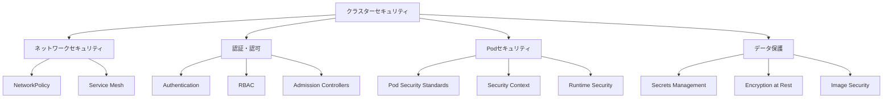

# 🔒 セキュリティ (Security)

このガイドでは、Kubernetesクラスターとアプリケーションのセキュリティについて学習します。AWS ECSでのIAMロールやSecurity Groupsとの比較を通じて、Kubernetesの包括的なセキュリティモデルを理解します。

## 🎯 学習目標

- Kubernetesのセキュリティモデルと多層防御
- RBAC（ロールベースアクセス制御）の理解と実装
- Pod Security StandardsとNetworkPolicyの活用
- AWS ECSセキュリティとの比較と移行戦略

## 📚 Kubernetesセキュリティの基本概念

### 🛡️ 多層防御モデル



### 🔐 セキュリティの4つの柱

1. **認証（Authentication）**: 誰がアクセスしているか
2. **認可（Authorization）**: 何にアクセスできるか
3. **監査（Auditing）**: 何が実行されたか
4. **暗号化（Encryption）**: データの保護

## 🎫 認証と認可 (Authentication & Authorization)

### 👤 認証メカニズム

#### 1. ServiceAccount（推奨）

```yaml
# ServiceAccount作成
apiVersion: v1
kind: ServiceAccount
metadata:
  name: webapp-service-account
  namespace: production
automountServiceAccountToken: true  # デフォルトでtrue

---
# Podでの使用
apiVersion: apps/v1
kind: Deployment
metadata:
  name: web-app
spec:
  template:
    spec:
      serviceAccountName: webapp-service-account
      containers:
      - name: app
        image: myapp:latest
```

#### 2. ユーザー証明書認証

```bash
# ユーザー証明書の生成
openssl genrsa -out user.key 2048
openssl req -new -key user.key -out user.csr -subj "/CN=john.doe/O=developers"

# CSRをKubernetesに提出
cat <<EOF | kubectl apply -f -
apiVersion: certificates.k8s.io/v1
kind: CertificateSigningRequest
metadata:
  name: john-doe
spec:
  request: $(cat user.csr | base64 | tr -d '\n')
  signerName: kubernetes.io/kube-apiserver-client
  usages:
  - client auth
EOF

# 証明書の承認
kubectl certificate approve john-doe
```

### 🔑 RBAC (Role-Based Access Control)

#### 📝 基本構成要素

```yaml
# Role: 名前空間内の権限定義
apiVersion: rbac.authorization.k8s.io/v1
kind: Role
metadata:
  namespace: production
  name: pod-reader
rules:
- apiGroups: [""]           # core API group
  resources: ["pods"]
  verbs: ["get", "watch", "list"]
- apiGroups: ["apps"]
  resources: ["deployments"]
  verbs: ["get", "list"]
  resourceNames: ["web-app"]  # 特定リソースのみ

---
# RoleBinding: ユーザー/ServiceAccountとRoleの紐付け
apiVersion: rbac.authorization.k8s.io/v1
kind: RoleBinding
metadata:
  name: read-pods
  namespace: production
subjects:
- kind: ServiceAccount
  name: webapp-service-account
  namespace: production
- kind: User
  name: john.doe
  apiGroup: rbac.authorization.k8s.io
roleRef:
  kind: Role
  name: pod-reader
  apiGroup: rbac.authorization.k8s.io
```

#### 🌐 ClusterRole と ClusterRoleBinding

```yaml
# ClusterRole: クラスター全体の権限定義
apiVersion: rbac.authorization.k8s.io/v1
kind: ClusterRole
metadata:
  name: cluster-monitor
rules:
- apiGroups: [""]
  resources: ["nodes", "persistentvolumes"]
  verbs: ["get", "list", "watch"]
- apiGroups: ["metrics.k8s.io"]
  resources: ["nodes", "pods"]
  verbs: ["get", "list"]

---
# ClusterRoleBinding: クラスター全体での権限付与
apiVersion: rbac.authorization.k8s.io/v1
kind: ClusterRoleBinding
metadata:
  name: monitor-cluster
subjects:
- kind: ServiceAccount
  name: monitoring-service-account
  namespace: monitoring
roleRef:
  kind: ClusterRole
  name: cluster-monitor
  apiGroup: rbac.authorization.k8s.io
```

#### 🔧 実践的なRBACパターン

```yaml
# 開発者向けRole: 開発環境での基本操作
apiVersion: rbac.authorization.k8s.io/v1
kind: Role
metadata:
  namespace: development
  name: developer
rules:
- apiGroups: ["", "apps", "extensions"]
  resources: ["*"]
  verbs: ["*"]
- apiGroups: [""]
  resources: ["secrets"]
  verbs: ["get", "list"]  # 機密情報は読み取りのみ

---
# 運用者向けRole: 本番環境での限定的操作
apiVersion: rbac.authorization.k8s.io/v1
kind: Role
metadata:
  namespace: production
  name: operator
rules:
- apiGroups: [""]
  resources: ["pods", "services", "configmaps"]
  verbs: ["get", "list", "watch"]
- apiGroups: ["apps"]
  resources: ["deployments", "replicasets"]
  verbs: ["get", "list", "watch", "patch"]  # スケール操作は可能
- apiGroups: [""]
  resources: ["pods/log"]
  verbs: ["get", "list"]  # ログ閲覧
```

## 🛡️ Pod Security Standards

### 📊 セキュリティレベル

| レベル | 説明 | 用途 |
|--------|------|------|
| **Privileged** | 制限なし | システムレベルワークロード |
| **Baseline** | 基本的な制限 | 一般的なアプリケーション |
| **Restricted** | 厳格な制限 | セキュリティ重視アプリケーション |

### 🔧 Pod Security Standards の実装

#### 1. Namespace レベルでの設定

```yaml
# Namespace にセキュリティポリシーを適用
apiVersion: v1
kind: Namespace
metadata:
  name: secure-apps
  labels:
    # ポリシーの強制
    pod-security.kubernetes.io/enforce: restricted
    pod-security.kubernetes.io/enforce-version: v1.25
    
    # 警告の表示
    pod-security.kubernetes.io/warn: restricted
    pod-security.kubernetes.io/warn-version: v1.25
    
    # 監査ログ
    pod-security.kubernetes.io/audit: restricted
    pod-security.kubernetes.io/audit-version: v1.25
```

#### 2. SecurityContext の設定

```yaml
# セキュアなPod設定例
apiVersion: apps/v1
kind: Deployment
metadata:
  name: secure-web-app
  namespace: secure-apps
spec:
  template:
    spec:
      # Pod レベルの SecurityContext
      securityContext:
        runAsNonRoot: true
        runAsUser: 1000
        runAsGroup: 3000
        fsGroup: 2000
        seccompProfile:
          type: RuntimeDefault
      
      containers:
      - name: web-app
        image: myapp:latest
        # Container レベルの SecurityContext
        securityContext:
          allowPrivilegeEscalation: false
          runAsNonRoot: true
          runAsUser: 1000
          capabilities:
            drop:
            - ALL
            add:
            - NET_BIND_SERVICE  # 80番ポートにバインドするため
          readOnlyRootFilesystem: true
        
        # 書き込み可能なディレクトリをマウント
        volumeMounts:
        - name: tmp
          mountPath: /tmp
        - name: cache
          mountPath: /app/cache
      
      volumes:
      - name: tmp
        emptyDir: {}
      - name: cache
        emptyDir: {}
```

#### 3. Admission Controller を使用したポリシー強制

```yaml
# Pod Security Policy (deprecated) の代替
# OPA Gatekeeper を使用した例
apiVersion: templates.gatekeeper.sh/v1beta1
kind: ConstraintTemplate
metadata:
  name: k8srequiredsecuritycontext
spec:
  crd:
    spec:
      names:
        kind: K8sRequiredSecurityContext
      validation:
        properties:
          runAsNonRoot:
            type: boolean
  targets:
    - target: admission.k8s.gatekeeper.sh
      rego: |
        package k8srequiredsecuritycontext
        
        violation[{"msg": msg}] {
            container := input.review.object.spec.containers[_]
            not container.securityContext.runAsNonRoot
            msg := "Container must run as non-root user"
        }

---
# 制約の適用
apiVersion: constraints.gatekeeper.sh/v1beta1
kind: K8sRequiredSecurityContext
metadata:
  name: must-run-as-nonroot
spec:
  match:
    kinds:
      - apiGroups: ["apps"]
        kinds: ["Deployment"]
  parameters:
    runAsNonRoot: true
```

## 🌐 ネットワークセキュリティ

### 🔥 NetworkPolicy

#### 1. 基本的なネットワーク分離

```yaml
# デフォルト拒否ポリシー
apiVersion: networking.k8s.io/v1
kind: NetworkPolicy
metadata:
  name: default-deny-all
  namespace: production
spec:
  podSelector: {}  # 全てのPodに適用
  policyTypes:
  - Ingress
  - Egress
  # rulesが空 = 全て拒否

---
# Web層への接続許可
apiVersion: networking.k8s.io/v1
kind: NetworkPolicy
metadata:
  name: allow-web-ingress
  namespace: production
spec:
  podSelector:
    matchLabels:
      tier: web
  policyTypes:
  - Ingress
  ingress:
  - from:
    - namespaceSelector:
        matchLabels:
          name: ingress-system
    ports:
    - protocol: TCP
      port: 8080
```

#### 2. 多層アプリケーションの分離

```yaml
# データベース層への接続制限
apiVersion: networking.k8s.io/v1
kind: NetworkPolicy
metadata:
  name: database-access-policy
  namespace: production
spec:
  podSelector:
    matchLabels:
      tier: database
  policyTypes:
  - Ingress
  - Egress
  ingress:
  # Web層からのみ接続許可
  - from:
    - podSelector:
        matchLabels:
          tier: web
    ports:
    - protocol: TCP
      port: 5432
  
  egress:
  # DNS解決のみ許可
  - to: []
    ports:
    - protocol: UDP
      port: 53

---
# キャッシュ層への接続制限
apiVersion: networking.k8s.io/v1
kind: NetworkPolicy
metadata:
  name: cache-access-policy
  namespace: production
spec:
  podSelector:
    matchLabels:
      tier: cache
  policyTypes:
  - Ingress
  ingress:
  # Web層とAPI層からのみ接続許可
  - from:
    - podSelector:
        matchLabels:
          tier: web
    - podSelector:
        matchLabels:
          tier: api
    ports:
    - protocol: TCP
      port: 6379
```

### 🔐 Service Mesh セキュリティ (Istio)

```yaml
# mTLS の強制
apiVersion: security.istio.io/v1beta1
kind: PeerAuthentication
metadata:
  name: default
  namespace: production
spec:
  mtls:
    mode: STRICT

---
# アクセス制御
apiVersion: security.istio.io/v1beta1
kind: AuthorizationPolicy
metadata:
  name: web-app-authz
  namespace: production
spec:
  selector:
    matchLabels:
      app: web-app
  rules:
  - from:
    - source:
        principals: ["cluster.local/ns/production/sa/api-service-account"]
    to:
    - operation:
        methods: ["GET", "POST"]
        paths: ["/api/*"]
```

## 🔍 イメージセキュリティ

### 📦 セキュアなイメージ管理

#### 1. イメージ脆弱性スキャン

```yaml
# Trivy を使用したイメージスキャン
apiVersion: v1
kind: ConfigMap
metadata:
  name: trivy-config
data:
  trivy.yaml: |
    severity: HIGH,CRITICAL
    ignore-unfixed: true
    format: json

---
apiVersion: batch/v1
kind: Job
metadata:
  name: image-scan
spec:
  template:
    spec:
      containers:
      - name: trivy
        image: aquasec/trivy:latest
        command: ["trivy"]
        args: ["image", "--config", "/etc/trivy/trivy.yaml", "myapp:latest"]
        volumeMounts:
        - name: config
          mountPath: /etc/trivy
      volumes:
      - name: config
        configMap:
          name: trivy-config
      restartPolicy: Never
```

#### 2. Admission Controller による画像制御

```yaml
# ImagePolicyWebhook 設定例
apiVersion: v1
kind: ConfigMap
metadata:
  name: image-policy-config
data:
  policy.json: |
    {
      "imagePolicy": {
        "kubeConfigFile": "/etc/kubernetes/image-policy-webhook-config",
        "allowTTL": 50,
        "denyTTL": 50,
        "retryBackoff": 500,
        "defaultAllow": false
      }
    }
```

### 🎯 Distroless イメージの使用

```dockerfile
# セキュアなマルチステージビルド
FROM node:18-alpine AS builder
WORKDIR /app
COPY package*.json ./
RUN npm ci --only=production

FROM gcr.io/distroless/nodejs18-debian11
COPY --from=builder /app/node_modules ./node_modules
COPY . .
USER 1000
EXPOSE 8080
CMD ["server.js"]
```

## 🆚 AWS ECS vs Kubernetes セキュリティ比較

| セキュリティ領域 | AWS ECS | Kubernetes | 移行時の考慮点 |
|------------------|---------|------------|----------------|
| **認証・認可** | IAM Roles | RBAC + ServiceAccount | IAMポリシーをRBACルールに変換 |
| **ネットワーク分離** | Security Groups | NetworkPolicy | SGルールをNetworkPolicyに移行 |
| **実行時セキュリティ** | Task Definition制約 | Pod Security Standards | 制約レベルの対応付け |
| **機密情報管理** | Secrets Manager | Secrets + External Secrets | 外部システム連携を検討 |
| **監査ログ** | CloudTrail | Audit Logs | ログ形式と監視方法の調整 |
| **イメージスキャン** | ECR Vulnerability Scanning | Trivy/Twistlock | スキャンツールの統合 |
| **コンプライアンス** | AWS Config | OPA/Gatekeeper | ポリシーの再実装 |

## 🔧 実践的なセキュリティ設定

### 1. 本番環境向けセキュリティ構成

```yaml
# セキュアな名前空間設定
apiVersion: v1
kind: Namespace
metadata:
  name: production
  labels:
    pod-security.kubernetes.io/enforce: restricted
    pod-security.kubernetes.io/warn: restricted
    pod-security.kubernetes.io/audit: restricted

---
# セキュアなServiceAccount
apiVersion: v1
kind: ServiceAccount
metadata:
  name: webapp-sa
  namespace: production
  annotations:
    eks.amazonaws.com/role-arn: arn:aws:iam::ACCOUNT:role/WebAppRole
automountServiceAccountToken: false  # 明示的に無効化

---
# 最小権限のRole
apiVersion: rbac.authorization.k8s.io/v1
kind: Role
metadata:
  namespace: production
  name: webapp-role
rules:
- apiGroups: [""]
  resources: ["configmaps"]
  verbs: ["get", "list"]
  resourceNames: ["app-config"]

---
# セキュアなDeployment
apiVersion: apps/v1
kind: Deployment
metadata:
  name: secure-webapp
  namespace: production
spec:
  template:
    spec:
      serviceAccountName: webapp-sa
      securityContext:
        runAsNonRoot: true
        runAsUser: 10001
        fsGroup: 10001
        seccompProfile:
          type: RuntimeDefault
      
      containers:
      - name: webapp
        image: myregistry.com/webapp:v1.2.3
        securityContext:
          allowPrivilegeEscalation: false
          runAsNonRoot: true
          runAsUser: 10001
          capabilities:
            drop: ["ALL"]
          readOnlyRootFilesystem: true
        
        resources:
          requests:
            memory: "64Mi"
            cpu: "250m"
          limits:
            memory: "128Mi"
            cpu: "500m"
        
        livenessProbe:
          httpGet:
            path: /health
            port: 8080
          initialDelaySeconds: 30
          periodSeconds: 10
        
        readinessProbe:
          httpGet:
            path: /ready
            port: 8080
          initialDelaySeconds: 5
          periodSeconds: 5
```

### 2. 監査とモニタリング

```yaml
# Falco によるランタイムセキュリティ監視
apiVersion: v1
kind: ConfigMap
metadata:
  name: falco-config
data:
  falco.yaml: |
    rules_file:
      - /etc/falco/falco_rules.yaml
      - /etc/falco/k8s_audit_rules.yaml
    
    json_output: true
    log_stderr: true
    log_syslog: false
    
    outputs:
      rate: 1
      max_burst: 1000
    
    syslog_output:
      enabled: false

---
apiVersion: apps/v1
kind: DaemonSet
metadata:
  name: falco
spec:
  selector:
    matchLabels:
      app: falco
  template:
    spec:
      containers:
      - name: falco
        image: falcosecurity/falco:latest
        securityContext:
          privileged: true
        volumeMounts:
        - name: dev
          mountPath: /host/dev
        - name: proc
          mountPath: /host/proc
        - name: etc
          mountPath: /host/etc
      volumes:
      - name: dev
        hostPath:
          path: /dev
      - name: proc
        hostPath:
          path: /proc
      - name: etc
        hostPath:
          path: /etc
```

## 🛠️ トラブルシューティング

### よくあるセキュリティ問題と解決方法

#### 1. RBAC 権限不足

```bash
# 現在の権限確認
kubectl auth can-i get pods --as=system:serviceaccount:production:webapp-sa

# ServiceAccountの権限確認
kubectl describe rolebinding -n production

# デバッグ用の権限付与（一時的）
kubectl create clusterrolebinding debug-binding \
  --clusterrole=view \
  --serviceaccount=production:webapp-sa
```

#### 2. NetworkPolicy 接続問題

```bash
# NetworkPolicy 確認
kubectl get networkpolicy -n production

# Pod 間の接続テスト
kubectl exec -it pod1 -- nc -zv pod2-service 8080

# NetworkPolicy のデバッグ
kubectl describe networkpolicy allow-web-ingress -n production
```

#### 3. Security Context エラー

```bash
# Pod のセキュリティ設定確認
kubectl get pod webapp-123 -o jsonpath='{.spec.securityContext}'

# イベント確認
kubectl describe pod webapp-123 | grep -A 10 Events

# Security Context の修正例
kubectl patch deployment webapp --patch '
{
  "spec": {
    "template": {
      "spec": {
        "securityContext": {
          "runAsNonRoot": true,
          "runAsUser": 1000
        }
      }
    }
  }
}'
```

## 🎯 学習チェック

### 理解度確認クイズ

<details>
<summary>Q1: AWS ECSのIAMロールをKubernetesに移行する際の対応関係は？</summary>

**A**: 
- **ECS Task Role** → **ServiceAccount + RBAC**
- **ECS Execution Role** → **Node IAM Role + Image Pull Secrets**

KubernetesではServiceAccountとRBACを組み合わせて細かい権限制御を行います。
</details>

<details>
<summary>Q2: Pod Security Standardsの3つのレベルの違いは？</summary>

**A**: 
- **Privileged**: 制限なし（システムコンポーネント用）
- **Baseline**: 基本的な制限（一般的なアプリケーション）
- **Restricted**: 厳格な制限（セキュリティ重視環境）

本番環境では通常BaselineまたはRestrictedを使用します。
</details>

<details>
<summary>Q3: NetworkPolicyとAWS Security Groupsの主な違いは？</summary>

**A**: 
- **対象**: NetworkPolicy=Pod、Security Groups=ENI
- **制御**: NetworkPolicy=L3/L4、Security Groups=L3/L4
- **スコープ**: NetworkPolicy=Namespace、Security Groups=VPC
- **管理**: NetworkPolicy=宣言的、Security Groups=命令的

NetworkPolicyはよりきめ細かな制御が可能です。
</details>

## 🔗 次のステップ

セキュリティの理解を深めたら、次は以下を学習してください：

1. **[ストレージ](./storage.md)** - 永続化データのセキュリティ
2. **[ネットワーキング](./networking.md)** - ネットワークセキュリティの詳細
3. **[実践チュートリアル](../../tutorials/security/)** - セキュリティ設定の実践

## 📚 参考資料

- [Kubernetes Security Documentation](https://kubernetes.io/docs/concepts/security/)
- [Pod Security Standards](https://kubernetes.io/docs/concepts/security/pod-security-standards/)
- [RBAC Documentation](https://kubernetes.io/docs/reference/access-authn-authz/rbac/)
- [Network Policies](https://kubernetes.io/docs/concepts/services-networking/network-policies/)
- [CIS Kubernetes Benchmark](https://www.cisecurity.org/benchmark/kubernetes)

---

**前へ**: [設定管理](./configuration.md) | **次へ**: [ストレージ](./storage.md)
