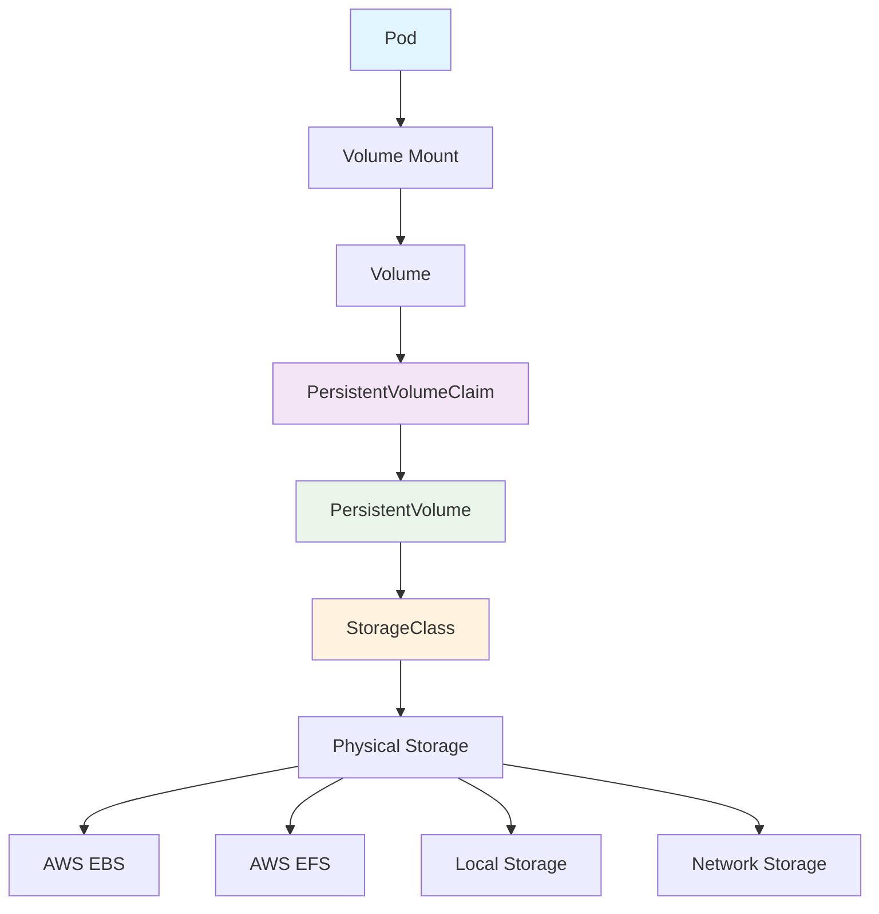

# 💾 ストレージ (Storage)

このガイドでは、Kubernetesにおける永続化ストレージとデータ管理について学習します。AWS ECSでのEBS/EFSの使用経験を活かしながら、Kubernetesの柔軟なストレージシステムを理解します。

## 🎯 学習目標

- Kubernetesストレージの階層構造の理解
- Volume、PV、PVCの関係性と使い分け
- StorageClassを使った動的プロビジョニング
- AWS EBS/EFSとの統合方法

## 📚 Kubernetesストレージの基本概念

### 🏗️ ストレージアーキテクチャ



### 🔄 ストレージライフサイクル

1. **StorageClass**: ストレージの種類と性能を定義
2. **PersistentVolume (PV)**: 物理ストレージリソース
3. **PersistentVolumeClaim (PVC)**: ストレージ要求
4. **Volume**: Podにマウントされるストレージ
5. **VolumeMount**: コンテナ内のマウントポイント

## 📦 Volume: 基本的なストレージ

### 🔧 Volume タイプ

#### 1. emptyDir - 一時ストレージ

```yaml
# 一時的なデータ共有用
apiVersion: v1
kind: Pod
metadata:
  name: web-app-with-cache
spec:
  containers:
  - name: web-app
    image: nginx:1.21
    volumeMounts:
    - name: cache-volume
      mountPath: /var/cache/nginx
    - name: tmp-volume
      mountPath: /tmp
  
  - name: log-processor
    image: fluentd:latest
    volumeMounts:
    - name: cache-volume
      mountPath: /shared/cache
      readOnly: true
  
  volumes:
  - name: cache-volume
    emptyDir:
      sizeLimit: 1Gi  # サイズ制限
  - name: tmp-volume
    emptyDir:
      medium: Memory  # メモリ上に作成
```

#### 2. hostPath - ホストディレクトリ

```yaml
# ホストのディレクトリをマウント
apiVersion: v1
kind: Pod
metadata:
  name: system-monitor
spec:
  containers:
  - name: monitor
    image: monitoring-app:latest
    volumeMounts:
    - name: host-sys
      mountPath: /host/sys
      readOnly: true
    - name: host-proc
      mountPath: /host/proc
      readOnly: true
  
  volumes:
  - name: host-sys
    hostPath:
      path: /sys
      type: Directory
  - name: host-proc
    hostPath:
      path: /proc
      type: Directory
```

#### 3. configMap と secret

```yaml
# 設定ファイルとしてマウント
apiVersion: v1
kind: Pod
metadata:
  name: configured-app
spec:
  containers:
  - name: app
    image: myapp:latest
    volumeMounts:
    - name: config-volume
      mountPath: /etc/config
    - name: secret-volume
      mountPath: /etc/secrets
      readOnly: true
  
  volumes:
  - name: config-volume
    configMap:
      name: app-config
      items:
      - key: database.conf
        path: database.conf
        mode: 0644
  
  - name: secret-volume
    secret:
      secretName: app-secrets
      defaultMode: 0400
```

## 🎯 PersistentVolume と PersistentVolumeClaim

### 📋 PersistentVolume (PV)

```yaml
# 静的に作成されるPV例
apiVersion: v1
kind: PersistentVolume
metadata:
  name: postgres-pv
  labels:
    type: ssd
    zone: us-west-2a
spec:
  capacity:
    storage: 20Gi
  
  accessModes:
    - ReadWriteOnce  # 単一ノードで読み書き
  
  persistentVolumeReclaimPolicy: Retain  # Delete, Recycle
  
  storageClassName: fast-ssd
  
  # AWS EBS ボリューム
  awsElasticBlockStore:
    volumeID: vol-0123456789abcdef0
    fsType: ext4
  
  # ノード制約
  nodeAffinity:
    required:
      nodeSelectorTerms:
      - matchExpressions:
        - key: topology.kubernetes.io/zone
          operator: In
          values:
          - us-west-2a

---
# AWS EFS の場合
apiVersion: v1
kind: PersistentVolume
metadata:
  name: efs-pv
spec:
  capacity:
    storage: 100Gi
  accessModes:
    - ReadWriteMany  # 複数ノードで読み書き
  persistentVolumeReclaimPolicy: Retain
  storageClassName: efs
  
  csi:
    driver: efs.csi.aws.com
    volumeHandle: fs-0123456789abcdef0
```

### 📝 PersistentVolumeClaim (PVC)

```yaml
# アプリケーションからのストレージ要求
apiVersion: v1
kind: PersistentVolumeClaim
metadata:
  name: postgres-storage
  namespace: database
spec:
  accessModes:
    - ReadWriteOnce
  
  storageClassName: fast-ssd
  
  resources:
    requests:
      storage: 20Gi
  
  # ラベルセレクター（静的バインディング用）
  selector:
    matchLabels:
      type: ssd
    matchExpressions:
    - key: zone
      operator: In
      values: ["us-west-2a", "us-west-2b"]

---
# PVC を使用するDeployment
apiVersion: apps/v1
kind: Deployment
metadata:
  name: postgres
  namespace: database
spec:
  replicas: 1  # ReadWriteOnceの場合は必須
  template:
    spec:
      containers:
      - name: postgres
        image: postgres:13
        env:
        - name: POSTGRES_DB
          value: myapp
        - name: POSTGRES_USER
          value: postgres
        - name: POSTGRES_PASSWORD
          valueFrom:
            secretKeyRef:
              name: postgres-secret
              key: password
        
        volumeMounts:
        - name: postgres-storage
          mountPath: /var/lib/postgresql/data
        
        ports:
        - containerPort: 5432
      
      volumes:
      - name: postgres-storage
        persistentVolumeClaim:
          claimName: postgres-storage
```

## ⚙️ StorageClass: 動的プロビジョニング

### 🔧 AWS EBS StorageClass

```yaml
# gp3 SSD用StorageClass
apiVersion: storage.k8s.io/v1
kind: StorageClass
metadata:
  name: gp3-ssd
provisioner: ebs.csi.aws.com
parameters:
  type: gp3
  iops: "3000"
  throughput: "125"
  encrypted: "true"
  
volumeBindingMode: WaitForFirstConsumer  # Pod作成時にバインド
allowVolumeExpansion: true
reclaimPolicy: Delete

---
# io2 高性能SSD用StorageClass
apiVersion: storage.k8s.io/v1
kind: StorageClass
metadata:
  name: io2-high-iops
provisioner: ebs.csi.aws.com
parameters:
  type: io2
  iops: "10000"
  encrypted: "true"
  
volumeBindingMode: Immediate
allowVolumeExpansion: true
reclaimPolicy: Retain  # 削除時に保持

---
# 共有ストレージ用EFS StorageClass
apiVersion: storage.k8s.io/v1
kind: StorageClass
metadata:
  name: efs-shared
provisioner: efs.csi.aws.com
parameters:
  provisioningMode: efs-ap  # Access Point作成
  fileSystemId: fs-0123456789abcdef0
  directoryPerms: "0755"
  gidRangeStart: "1000"
  gidRangeEnd: "2000"
  basePath: "/shared"

volumeBindingMode: Immediate
reclaimPolicy: Delete
```

### 📊 StorageClass使用例

```yaml
# 高性能データベース用PVC
apiVersion: v1
kind: PersistentVolumeClaim
metadata:
  name: database-storage
spec:
  accessModes:
    - ReadWriteOnce
  storageClassName: io2-high-iops
  resources:
    requests:
      storage: 100Gi

---
# 共有ファイルシステム用PVC
apiVersion: v1
kind: PersistentVolumeClaim
metadata:
  name: shared-files
spec:
  accessModes:
    - ReadWriteMany
  storageClassName: efs-shared
  resources:
    requests:
      storage: 50Gi

---
# 一般的なアプリケーション用PVC
apiVersion: v1
kind: PersistentVolumeClaim
metadata:
  name: app-data
spec:
  accessModes:
    - ReadWriteOnce
  storageClassName: gp3-ssd
  resources:
    requests:
      storage: 10Gi
```

## 📊 StatefulSet でのストレージ管理

### 🗄️ データベースクラスター例

```yaml
# PostgreSQL StatefulSet
apiVersion: apps/v1
kind: StatefulSet
metadata:
  name: postgres-cluster
  namespace: database
spec:
  serviceName: postgres-headless
  replicas: 3
  
  template:
    metadata:
      labels:
        app: postgres
    spec:
      containers:
      - name: postgres
        image: postgres:13
        env:
        - name: POSTGRES_USER
          value: postgres
        - name: POSTGRES_PASSWORD
          valueFrom:
            secretKeyRef:
              name: postgres-secret
              key: password
        - name: POSTGRES_DB
          value: myapp
        
        ports:
        - containerPort: 5432
          name: postgres
        
        volumeMounts:
        - name: postgres-data
          mountPath: /var/lib/postgresql/data
        - name: postgres-config
          mountPath: /etc/postgresql
      
      volumes:
      - name: postgres-config
        configMap:
          name: postgres-config
  
  # 動的PVCテンプレート
  volumeClaimTemplates:
  - metadata:
      name: postgres-data
    spec:
      accessModes: ["ReadWriteOnce"]
      storageClassName: gp3-ssd
      resources:
        requests:
          storage: 50Gi

---
# Headless Service（StatefulSet用）
apiVersion: v1
kind: Service
metadata:
  name: postgres-headless
  namespace: database
spec:
  clusterIP: None  # Headless
  selector:
    app: postgres
  ports:
  - port: 5432
    name: postgres
```

### 📈 Redis Cluster例

```yaml
# Redis StatefulSet
apiVersion: apps/v1
kind: StatefulSet
metadata:
  name: redis-cluster
  namespace: cache
spec:
  serviceName: redis-headless
  replicas: 6
  
  template:
    spec:
      containers:
      - name: redis
        image: redis:6.2-alpine
        command: ["redis-server"]
        args: ["/etc/redis/redis.conf"]
        
        ports:
        - containerPort: 6379
          name: redis
        - containerPort: 16379
          name: cluster
        
        volumeMounts:
        - name: redis-data
          mountPath: /data
        - name: redis-config
          mountPath: /etc/redis
        
        livenessProbe:
          exec:
            command: ["redis-cli", "ping"]
          initialDelaySeconds: 30
          periodSeconds: 10
        
        readinessProbe:
          exec:
            command: ["redis-cli", "ping"]
          initialDelaySeconds: 5
          periodSeconds: 5
      
      volumes:
      - name: redis-config
        configMap:
          name: redis-config
  
  volumeClaimTemplates:
  - metadata:
      name: redis-data
    spec:
      accessModes: ["ReadWriteOnce"]
      storageClassName: gp3-ssd
      resources:
        requests:
          storage: 10Gi
```

## 🔄 ストレージのバックアップと復元

### 💾 Volume Snapshot

```yaml
# VolumeSnapshotClass
apiVersion: snapshot.storage.k8s.io/v1
kind: VolumeSnapshotClass
metadata:
  name: ebs-snapshot-class
driver: ebs.csi.aws.com
deletionPolicy: Delete
parameters:
  tagSpecification_1: "Name=*"
  tagSpecification_2: "Environment=production"

---
# VolumeSnapshot作成
apiVersion: snapshot.storage.k8s.io/v1
kind: VolumeSnapshot
metadata:
  name: postgres-backup-20240101
  namespace: database
spec:
  volumeSnapshotClassName: ebs-snapshot-class
  source:
    persistentVolumeClaimName: postgres-storage

---
# スナップショットからの復元
apiVersion: v1
kind: PersistentVolumeClaim
metadata:
  name: postgres-restored
  namespace: database
spec:
  accessModes:
    - ReadWriteOnce
  storageClassName: gp3-ssd
  
  # スナップショットを元にPVC作成
  dataSource:
    name: postgres-backup-20240101
    kind: VolumeSnapshot
    apiGroup: snapshot.storage.k8s.io
  
  resources:
    requests:
      storage: 50Gi
```

### 🔄 自動バックアップジョブ

```yaml
# 定期バックアップCronJob
apiVersion: batch/v1
kind: CronJob
metadata:
  name: postgres-backup
  namespace: database
spec:
  schedule: "0 2 * * *"  # 毎日午前2時
  jobTemplate:
    spec:
      template:
        spec:
          containers:
          - name: backup
            image: postgres:13
            command: ["/bin/bash"]
            args:
            - -c
            - |
              DATE=$(date +%Y%m%d_%H%M%S)
              pg_dump -h postgres-service -U postgres myapp > /backup/backup_${DATE}.sql
              
              # S3にアップロード
              aws s3 cp /backup/backup_${DATE}.sql s3://myapp-backups/postgres/
              
              # 古いバックアップを削除（30日以上）
              find /backup -name "backup_*.sql" -mtime +30 -delete
            
            env:
            - name: PGPASSWORD
              valueFrom:
                secretKeyRef:
                  name: postgres-secret
                  key: password
            
            volumeMounts:
            - name: backup-volume
              mountPath: /backup
          
          volumes:
          - name: backup-volume
            persistentVolumeClaim:
              claimName: backup-storage
          
          restartPolicy: OnFailure
```

## 🆚 AWS ECS vs Kubernetes ストレージ比較

| ストレージタイプ | AWS ECS | Kubernetes | 使用ケース |
|------------------|---------|------------|------------|
| **一時ストレージ** | Task Definition Volume | emptyDir | キャッシュ、一時ファイル |
| **永続ストレージ** | EFS/EBS Mount | PVC + PV | データベース、ログ |
| **設定ファイル** | EFS/Parameter Store | ConfigMap Volume | アプリケーション設定 |
| **機密ファイル** | Secrets Manager | Secret Volume | 証明書、キー |
| **共有ストレージ** | EFS | EFS CSI / NFS | 複数Pod間でのファイル共有 |
| **高性能ストレージ** | EBS io2 | StorageClass io2 | データベース、高I/O |
| **バックアップ** | EBS Snapshot | VolumeSnapshot | 障害復旧、データ保護 |

## 🔧 実践的なストレージパターン

### 1. 多層ストレージ構成

```yaml
# Web + DB + Cache の組み合わせ
apiVersion: v1
kind: Namespace
metadata:
  name: webapp

---
# Web層: 一時ストレージ
apiVersion: apps/v1
kind: Deployment
metadata:
  name: web-frontend
  namespace: webapp
spec:
  template:
    spec:
      containers:
      - name: frontend
        image: nginx:1.21
        volumeMounts:
        - name: cache
          mountPath: /var/cache/nginx
        - name: temp
          mountPath: /tmp
      
      volumes:
      - name: cache
        emptyDir:
          sizeLimit: 1Gi
      - name: temp
        emptyDir: {}

---
# DB層: 永続ストレージ
apiVersion: apps/v1
kind: StatefulSet
metadata:
  name: database
  namespace: webapp
spec:
  serviceName: db-headless
  template:
    spec:
      containers:
      - name: postgres
        image: postgres:13
        volumeMounts:
        - name: db-data
          mountPath: /var/lib/postgresql/data
  
  volumeClaimTemplates:
  - metadata:
      name: db-data
    spec:
      accessModes: ["ReadWriteOnce"]
      storageClassName: io2-high-iops
      resources:
        requests:
          storage: 100Gi

---
# 共有ファイル: EFS
apiVersion: v1
kind: PersistentVolumeClaim
metadata:
  name: shared-uploads
  namespace: webapp
spec:
  accessModes:
    - ReadWriteMany
  storageClassName: efs-shared
  resources:
    requests:
      storage: 50Gi
```

### 2. 災害復旧構成

```yaml
# プライマリリージョンのPVC
apiVersion: v1
kind: PersistentVolumeClaim
metadata:
  name: primary-database
  namespace: production
  annotations:
    volume.beta.kubernetes.io/storage-class: gp3-ssd
spec:
  accessModes:
    - ReadWriteOnce
  resources:
    requests:
      storage: 100Gi

---
# スナップショット作成CronJob
apiVersion: batch/v1
kind: CronJob
metadata:
  name: create-daily-snapshot
  namespace: production
spec:
  schedule: "0 1 * * *"  # 毎日午前1時
  jobTemplate:
    spec:
      template:
        spec:
          serviceAccountName: snapshot-creator
          containers:
          - name: snapshot
            image: bitnami/kubectl:latest
            command: ["/bin/bash"]
            args:
            - -c
            - |
              DATE=$(date +%Y%m%d)
              kubectl create -f - <<EOF
              apiVersion: snapshot.storage.k8s.io/v1
              kind: VolumeSnapshot
              metadata:
                name: daily-backup-${DATE}
                namespace: production
              spec:
                volumeSnapshotClassName: ebs-snapshot-class
                source:
                  persistentVolumeClaimName: primary-database
              EOF
          
          restartPolicy: OnFailure

---
# セカンダリリージョン復元用
apiVersion: v1
kind: PersistentVolumeClaim
metadata:
  name: disaster-recovery-db
  namespace: production
spec:
  accessModes:
    - ReadWriteOnce
  storageClassName: gp3-ssd
  
  # 最新スナップショットから復元
  dataSource:
    name: daily-backup-20240101  # 実際のスナップショット名
    kind: VolumeSnapshot
    apiGroup: snapshot.storage.k8s.io
  
  resources:
    requests:
      storage: 100Gi
```

## 🛠️ トラブルシューティング

### よくあるストレージ問題と解決方法

#### 1. PVC がバインドされない

```bash
# PVC の状態確認
kubectl get pvc -n production

# 詳細情報の確認
kubectl describe pvc postgres-storage -n production

# 利用可能なPVの確認
kubectl get pv

# StorageClassの確認
kubectl get storageclass

# CSI ドライバーの確認
kubectl get pods -n kube-system | grep csi
```

#### 2. ボリュームマウントエラー

```bash
# Pod のイベント確認
kubectl describe pod webapp-123 -n production

# ボリューム情報の確認
kubectl get pod webapp-123 -o jsonpath='{.spec.volumes[*]}'

# ノードのCSIドライバー状態確認
kubectl get csinodes

# ディスク使用量確認
kubectl exec webapp-123 -- df -h
```

#### 3. パフォーマンス問題

```bash
# ボリュームのIOPS確認
kubectl get pv pv-name -o jsonpath='{.spec.csi.volumeAttributes}'

# ストレージメトリクス確認
kubectl top pod webapp-123 --containers

# ディスクI/O統計
kubectl exec webapp-123 -- iostat -x 1 5
```

## 🎯 学習チェック

### 理解度確認クイズ

<details>
<summary>Q1: emptyDir、hostPath、PVCの使い分けは？</summary>

**A**: 
- **emptyDir**: Pod内コンテナ間の一時的なデータ共有
- **hostPath**: ホストファイルシステムへのアクセス（監視等）
- **PVC**: 永続的なデータ保存（データベース等）

用途とデータの永続性に応じて選択します。
</details>

<details>
<summary>Q2: AWS ECSでEBSボリュームを使っていた場合、Kubernetesでは？</summary>

**A**: 
- **ECS Task + EBS** → **StatefulSet + PVC + EBS StorageClass**
- 動的プロビジョニングにより、PVCがEBSボリュームを自動作成
- StorageClassでボリュームタイプやIOPSを制御

より柔軟で宣言的な管理が可能になります。
</details>

<details>
<summary>Q3: ReadWriteOnce と ReadWriteMany の違いは？</summary>

**A**: 
- **ReadWriteOnce**: 単一ノードからのみアクセス可能（EBS）
- **ReadWriteMany**: 複数ノードから同時アクセス可能（EFS、NFS）

データベースはRWO、共有ファイルシステムはRWMを使用します。
</details>

## 🔗 次のステップ

ストレージを理解したら、次は以下を学習してください：

1. **[ネットワーキング](./networking.md)** - ネットワーク構成とストレージアクセス
2. **[監視とログ](./observability.md)** - ストレージメトリクスと監視
3. **[実践チュートリアル](../../tutorials/storage/)** - ストレージ構成の実践

## 📚 参考資料

- [Kubernetes Storage Documentation](https://kubernetes.io/docs/concepts/storage/)
- [AWS EBS CSI Driver](https://github.com/kubernetes-sigs/aws-ebs-csi-driver)
- [AWS EFS CSI Driver](https://github.com/kubernetes-sigs/aws-efs-csi-driver)
- [Volume Snapshots](https://kubernetes.io/docs/concepts/storage/volume-snapshots/)
- [Storage Classes](https://kubernetes.io/docs/concepts/storage/storage-classes/)

---

**前へ**: [セキュリティ](./security.md) | **次へ**: [ネットワーキング](./networking.md)
