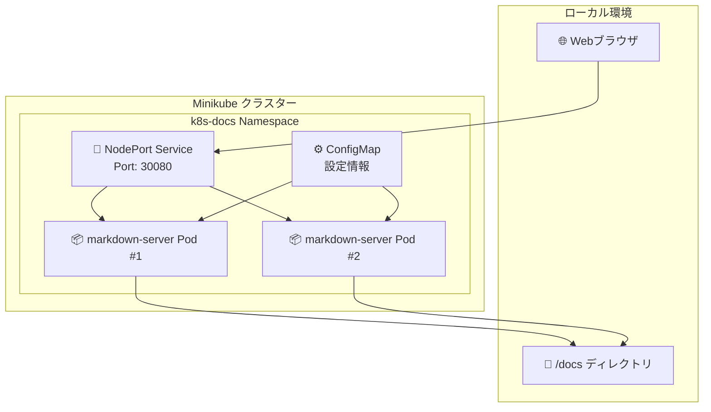

# 📖 Kubernetes学習ドキュメントサーバー

このプロジェクトは、作成したKubernetes学習ドキュメントをローカルブラウザで快適に閲覧するためのMarkdown & Mermaid対応Webサーバーです。

## 🎯 特徴

- **📄 Markdown表示**: 美しくレンダリングされたMarkdownドキュメント
- **📊 Mermaid図表**: インタラクティブな図表表示サポート
- **🔍 ファイル検索**: ドキュメントの高速検索機能
- **📁 ファイルツリー**: 直感的なファイルナビゲーション
- **🎨 レスポンシブUI**: PC・タブレット・モバイル対応
- **⚡ 高速表示**: 軽量でスムーズな動作

## 🚀 クイックスタート

### 1. 前提条件

```bash
# 必要なツールの確認
docker --version
kubectl version --client
minikube version

# minikube起動
minikube start

# 重要: ドキュメントディレクトリをminikubeにマウント
# このコマンドは別ターミナルでバックグラウンド実行する必要があります
minikube mount <path-to->/kamigenates/docs:/docs &
```

**⚠️ 重要な注意事項:**
- `minikube mount`は継続的に実行される必要があります
- 別ターミナルで実行するか、バックグラウンド（&）で実行してください
- サーバーを停止する際は、このプロセスも停止する必要があります

### 2. デプロイ実行

```bash
# 実行権限付与
chmod +x deploy.sh

# 全体デプロイ
./deploy.sh

# または段階的実行
./deploy.sh build    # Dockerイメージビルド
./deploy.sh apply    # Kubernetesリソース適用
./deploy.sh status   # 状態確認
./deploy.sh url      # アクセスURL表示
```

### 3. ブラウザアクセス

デプロイ完了後、表示されるURLでアクセス：
```
🌐 アクセスURL: http://192.168.49.2:30080
```

## 📋 アーキテクチャ

### システム構成



### コンポーネント

| コンポーネント | 役割 | 設定 |
|---------------|------|------|
| **Deployment** | Podの管理・スケーリング | 2レプリカ, RollingUpdate |
| **Service** | 外部アクセス・負荷分散 | NodePort 30080 |
| **ConfigMap** | 設定情報管理 | アプリケーション設定 |
| **Volume** | ドキュメントマウント | HostPath /docs |

## 🛠️ 開発・運用

### ローカル開発

```bash
# Node.js環境での開発
cd markdown-server
npm install
npm run dev

# ブラウザでアクセス
open http://localhost:3000
```

### ログ確認

```bash
# Pod ログ確認
kubectl logs -f deployment/markdown-server -n k8s-docs

# 特定Pod のログ
kubectl logs -f pod/<pod-name> -n k8s-docs
```

### スケーリング

```bash
# レプリカ数変更
kubectl scale deployment markdown-server --replicas=3 -n k8s-docs

# 状態確認
kubectl get pods -n k8s-docs -w
```

### アップデート

```bash
# 新しいイメージでアップデート
./deploy.sh build
kubectl rollout restart deployment/markdown-server -n k8s-docs

# ロールアウト状況確認
kubectl rollout status deployment/markdown-server -n k8s-docs
```

## 🔧 設定

### 環境変数（ConfigMap）

| 変数名 | デフォルト値 | 説明 |
|--------|-------------|------|
| `PORT` | 3000 | サーバーポート |
| `NODE_ENV` | production | 実行環境 |
| `DOCS_PATH` | /docs | ドキュメントパス |
| `MERMAID_THEME` | default | Mermaidテーマ |

### リソース制限

```yaml
resources:
  requests:
    memory: "128Mi"
    cpu: "100m"
  limits:
    memory: "512Mi"
    cpu: "500m"
```

## 📊 監視・ヘルスチェック

### エンドポイント

- **ヘルスチェック**: `/health`
- **ファイル一覧**: `/api/files`
- **Markdown変換**: `/api/markdown/*`

### Prometheus メトリクス

```yaml
annotations:
  prometheus.io/scrape: "true"
  prometheus.io/port: "3000"
  prometheus.io/path: "/health"
```

## 🚨 トラブルシューティング

### よくある問題

#### 1. Podが起動しない
```bash
# Pod状態確認
kubectl describe pod -l app=markdown-server -n k8s-docs

# ログ確認
kubectl logs -l app=markdown-server -n k8s-docs
```

#### 2. ドキュメントが表示されない
```bash
# ボリュームマウント確認
kubectl exec -it deployment/markdown-server -n k8s-docs -- ls -la /docs

# パス確認
ls -la <path-to->/kamigenates/docs
```

#### 3. サービスにアクセスできない
```bash
# Service確認
kubectl get svc -n k8s-docs
minikube service markdown-server-service --url -n k8s-docs

# ファイアウォール確認（Windows）
netsh advfirewall firewall show rule name="minikube"
```

## 🧹 クリーンアップ

```bash
# リソース削除
./deploy.sh cleanup

# または手動削除
kubectl delete namespace k8s-docs

# Dockerイメージ削除
docker rmi k8s-markdown-server:latest
```

## 🔒 セキュリティ

### 実装済み対策

- ✅ 非特権ユーザーでの実行
- ✅ ReadOnlyRootFilesystem
- ✅ 不要なCapabilities削除
- ✅ リソース制限設定
- ✅ NetworkPolicy適用可能

### 追加推奨事項

```bash
# NetworkPolicy適用例
kubectl apply -f - <<EOF
apiVersion: networking.k8s.io/v1
kind: NetworkPolicy
metadata:
  name: markdown-server-netpol
  namespace: k8s-docs
spec:
  podSelector:
    matchLabels:
      app: markdown-server
  policyTypes:
  - Ingress
  ingress:
  - ports:
    - protocol: TCP
      port: 3000
EOF
```

## 📚 参考資料

- [Kubernetes公式ドキュメント](https://kubernetes.io/docs/)
- [Express.js ガイド](https://expressjs.com/)
- [Mermaid.js ドキュメント](https://mermaid.js.org/)
- [markdown-it プラグイン](https://github.com/markdown-it/markdown-it)

## 🤝 コントリビューション

改善提案やバグ報告は以下で受け付けています：

1. **機能追加**: 新しいMarkdown拡張機能
2. **UI改善**: レスポンシブデザインの最適化
3. **パフォーマンス**: 読み込み速度の向上
4. **セキュリティ**: セキュリティ強化

---

**📝 更新日**: 2025年7月2日 | **🎯 対象**: Kubernetes学習者 | **📊 難易度**: 中級
