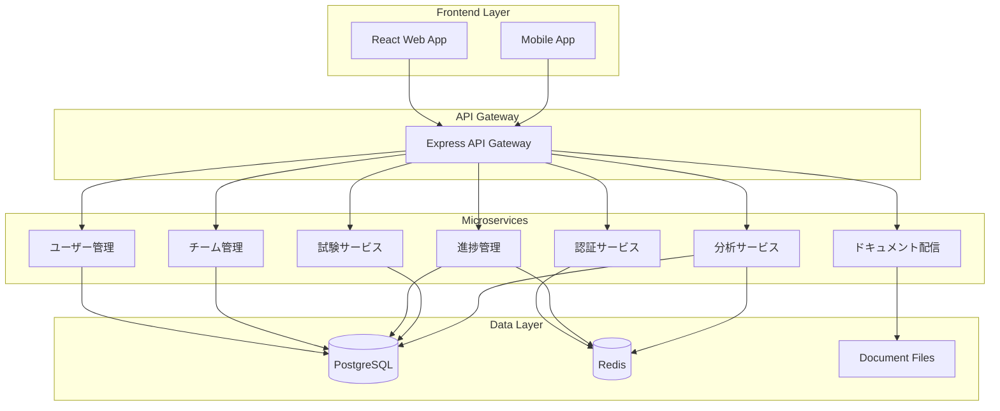

# 🎓 チーム学習プラットフォーム設計書

## 📖 概要

既存のmarkdown-serverを拡張し、チーム単位でのKubernetes学習を支援する包括的なプラットフォームを構築します。

## 🎯 主要機能

### 1. ユーザー・チーム管理
- **ユーザー登録・認証**: ID/Password + OAuth2.0 (Google/GitHub)
- **チーム管理**: ユーザーのチーム所属管理
- **権限管理**: スーパー管理者 / チームマネージャー / 一般ユーザー

### 2. 学習進捗管理
- **読書進捗**: ページ単位の進捗追跡・滞在時間計測
- **お気に入り**: ブックマーク機能・★表示
- **進捗バー**: リアルタイム進捗表示

### 3. リーダーボード
- **個人進捗**: 自分の学習状況
- **チーム比較**: チーム内メンバーの進捗
- **全体統計**: 全チームの習熟度比較

### 4. 習熟度システム
- **5段階評価**: ★0(未読) ～ ★5(完全習得)
- **3種類の試験**:
  - 概念試験: 選択式クイズ
  - 机上試験: YAML記述試験
  - 実技試験: kubectl操作実習

### 5. 管理ダッシュボード
- **統計可視化**: Chart.js/D3.jsによるグラフ表示
- **ユーザー管理**: 登録・削除・チーム編集
- **学習分析**: 進捗レポート生成

## 🏗️ システムアーキテクチャ

### 技術スタック

**フロントエンド:**
- React 18 + TypeScript
- Material-UI v5
- Chart.js + D3.js
- React Router v6

**バックエンド:**
- Node.js + Express + TypeScript
- Passport.js (認証)
- Prisma ORM

**データベース:**
- PostgreSQL 15 (永続データ)
- Redis 7 (セッション・キャッシュ)

**インフラ:**
- Docker + Kubernetes
- Minikube (開発環境)

### マイクロサービス構成



## 🗄️ データベース設計

### PostgreSQL テーブル設計

#### ユーザー・チーム関連
```sql
-- ユーザーテーブル
CREATE TABLE users (
    id UUID PRIMARY KEY DEFAULT gen_random_uuid(),
    username VARCHAR(50) UNIQUE NOT NULL,
    email VARCHAR(100) UNIQUE NOT NULL,
    password_hash VARCHAR(255), -- NULL for OAuth users
    display_name VARCHAR(100) NOT NULL,
    avatar_url TEXT,
    role user_role NOT NULL DEFAULT 'user',
    oauth_provider VARCHAR(20), -- 'google', 'github', etc.
    oauth_id VARCHAR(100),
    is_active BOOLEAN DEFAULT true,
    last_login_at TIMESTAMP,
    created_at TIMESTAMP DEFAULT NOW(),
    updated_at TIMESTAMP DEFAULT NOW()
);

-- チームテーブル
CREATE TABLE teams (
    id UUID PRIMARY KEY DEFAULT gen_random_uuid(),
    name VARCHAR(100) NOT NULL,
    description TEXT,
    created_by UUID REFERENCES users(id),
    is_active BOOLEAN DEFAULT true,
    created_at TIMESTAMP DEFAULT NOW(),
    updated_at TIMESTAMP DEFAULT NOW()
);

-- チームメンバーシップ
CREATE TABLE team_memberships (
    id UUID PRIMARY KEY DEFAULT gen_random_uuid(),
    user_id UUID REFERENCES users(id),
    team_id UUID REFERENCES teams(id),
    role team_role DEFAULT 'member',
    joined_at TIMESTAMP DEFAULT NOW(),
    UNIQUE(user_id, team_id)
);

-- 権限定義
CREATE TYPE user_role AS ENUM ('super_admin', 'team_manager', 'user');
CREATE TYPE team_role AS ENUM ('manager', 'member');
```

#### 学習進捗関連
```sql
-- ドキュメント情報
CREATE TABLE documents (
    id UUID PRIMARY KEY DEFAULT gen_random_uuid(),
    file_path TEXT UNIQUE NOT NULL,
    title VARCHAR(200) NOT NULL,
    category VARCHAR(100),
    estimated_reading_time INTEGER, -- minutes
    difficulty_level INTEGER CHECK (difficulty_level BETWEEN 1 AND 5),
    prerequisites TEXT[], -- array of document IDs
    created_at TIMESTAMP DEFAULT NOW(),
    updated_at TIMESTAMP DEFAULT NOW()
);

-- 読書進捗
CREATE TABLE reading_progress (
    id UUID PRIMARY KEY DEFAULT gen_random_uuid(),
    user_id UUID REFERENCES users(id),
    document_id UUID REFERENCES documents(id),
    progress_percentage DECIMAL(5,2) CHECK (progress_percentage BETWEEN 0 AND 100),
    total_reading_time INTEGER DEFAULT 0, -- seconds
    last_position INTEGER DEFAULT 0, -- scroll position
    completed_at TIMESTAMP,
    created_at TIMESTAMP DEFAULT NOW(),
    updated_at TIMESTAMP DEFAULT NOW(),
    UNIQUE(user_id, document_id)
);

-- お気に入り
CREATE TABLE favorites (
    id UUID PRIMARY KEY DEFAULT gen_random_uuid(),
    user_id UUID REFERENCES users(id),
    document_id UUID REFERENCES documents(id),
    notes TEXT,
    created_at TIMESTAMP DEFAULT NOW(),
    UNIQUE(user_id, document_id)
);
```

#### 習熟度・試験関連
```sql
-- 試験テーブル
CREATE TABLE exams (
    id UUID PRIMARY KEY DEFAULT gen_random_uuid(),
    document_id UUID REFERENCES documents(id),
    title VARCHAR(200) NOT NULL,
    exam_type exam_type NOT NULL,
    description TEXT,
    time_limit INTEGER, -- minutes
    passing_score DECIMAL(5,2),
    max_attempts INTEGER DEFAULT 3,
    is_active BOOLEAN DEFAULT true,
    created_at TIMESTAMP DEFAULT NOW(),
    updated_at TIMESTAMP DEFAULT NOW()
);

-- 試験問題
CREATE TABLE exam_questions (
    id UUID PRIMARY KEY DEFAULT gen_random_uuid(),
    exam_id UUID REFERENCES exams(id),
    question_type question_type NOT NULL,
    question_text TEXT NOT NULL,
    expected_answer TEXT,
    options JSONB, -- for multiple choice
    points INTEGER DEFAULT 1,
    order_index INTEGER,
    created_at TIMESTAMP DEFAULT NOW()
);

-- 試験結果
CREATE TABLE exam_attempts (
    id UUID PRIMARY KEY DEFAULT gen_random_uuid(),
    user_id UUID REFERENCES users(id),
    exam_id UUID REFERENCES exams(id),
    score DECIMAL(5,2),
    total_points INTEGER,
    time_taken INTEGER, -- seconds
    answers JSONB,
    kubectl_logs TEXT, -- for practical exams
    completed_at TIMESTAMP,
    created_at TIMESTAMP DEFAULT NOW()
);

-- 習熟度
CREATE TABLE proficiency_levels (
    id UUID PRIMARY KEY DEFAULT gen_random_uuid(),
    user_id UUID REFERENCES users(id),
    document_id UUID REFERENCES documents(id),
    level INTEGER CHECK (level BETWEEN 0 AND 5),
    concept_score DECIMAL(5,2),
    practical_score DECIMAL(5,2),
    yaml_score DECIMAL(5,2),
    last_updated TIMESTAMP DEFAULT NOW(),
    UNIQUE(user_id, document_id)
);

-- 列挙型定義
CREATE TYPE exam_type AS ENUM ('concept', 'yaml', 'practical');
CREATE TYPE question_type AS ENUM ('multiple_choice', 'yaml_generation', 'kubectl_command');
```

### Redis データ構造設計

#### セッション管理
```
sess:{sessionId} = {
    userId: UUID,
    username: string,
    role: string,
    teamIds: UUID[],
    lastActivity: timestamp,
    expiresAt: timestamp
}
```

#### キャッシュ戦略
```
# ユーザー情報キャッシュ
user:{userId} = JSON user data (TTL: 1 hour)

# チーム情報キャッシュ
team:{teamId} = JSON team data (TTL: 30 minutes)

# リーダーボードキャッシュ
leaderboard:team:{teamId} = JSON sorted progress data (TTL: 5 minutes)
leaderboard:global = JSON global stats (TTL: 10 minutes)

# アクティブユーザー
active_users = SET of userIds (TTL: 15 minutes)

# 試験進行状況
exam_session:{userId}:{examId} = {
    startTime: timestamp,
    answers: {},
    timeRemaining: integer
} (TTL: exam time limit)
```

## 📋 API設計

### 認証・ユーザー管理 API
```
POST /api/auth/login
POST /api/auth/logout
POST /api/auth/oauth/{provider}
GET  /api/auth/me

GET    /api/users
POST   /api/users
GET    /api/users/{id}
PUT    /api/users/{id}
DELETE /api/users/{id}
```

### チーム管理 API
```
GET    /api/teams
POST   /api/teams
GET    /api/teams/{id}
PUT    /api/teams/{id}
DELETE /api/teams/{id}
POST   /api/teams/{id}/members
DELETE /api/teams/{id}/members/{userId}
```

### 学習進捗 API
```
GET    /api/documents
GET    /api/documents/{id}
GET    /api/progress
POST   /api/progress
PUT    /api/progress/{documentId}

GET    /api/favorites
POST   /api/favorites
DELETE /api/favorites/{documentId}
```

### 習熟度・試験 API
```
GET    /api/exams
GET    /api/exams/{id}
POST   /api/exams/{id}/attempts
GET    /api/proficiency
GET    /api/proficiency/{documentId}
```

### リーダーボード API
```
GET /api/leaderboard/team/{teamId}
GET /api/leaderboard/global
GET /api/analytics/team/{teamId}
GET /api/analytics/user/{userId}
```

## 🔒 セキュリティ設計

### 認証・認可
- **JWT**: アクセストークン (15分有効)
- **Redis**: リフレッシュトークン (7日有効)
- **RBAC**: ロールベースアクセス制御
- **OAuth2.0**: Google/GitHub連携

### データ保護
- **暗号化**: パスワードはbcryptでハッシュ化
- **HTTPS**: 通信の暗号化
- **CORS**: オリジン制限
- **Rate Limiting**: API呼び出し制限

## 🚀 開発フェーズ

### Phase 1: 基盤構築 (1-2週間)
- [ ] Docker環境構築 (PostgreSQL + Redis)
- [ ] 基本API構造構築
- [ ] 認証システム実装

### Phase 2: コア機能 (2-3週間)
- [ ] ユーザー・チーム管理
- [ ] 読書進捗追跡
- [ ] お気に入り機能

### Phase 3: 習熟度システム (2-3週間)
- [ ] 試験エンジン
- [ ] YAML評価システム
- [ ] 実技試験ログ解析

### Phase 4: ダッシュボード (1-2週間)
- [ ] React フロントエンド
- [ ] Chart.js データ可視化
- [ ] リーダーボード

### Phase 5: 最適化・テスト (1週間)
- [ ] パフォーマンス最適化
- [ ] セキュリティテスト
- [ ] ドキュメント整備

---

**📅 更新日**: 2025年7月3日 | **👥 対象**: Kubernetes学習チーム | **🎯 目標**: チーム学習効率化
