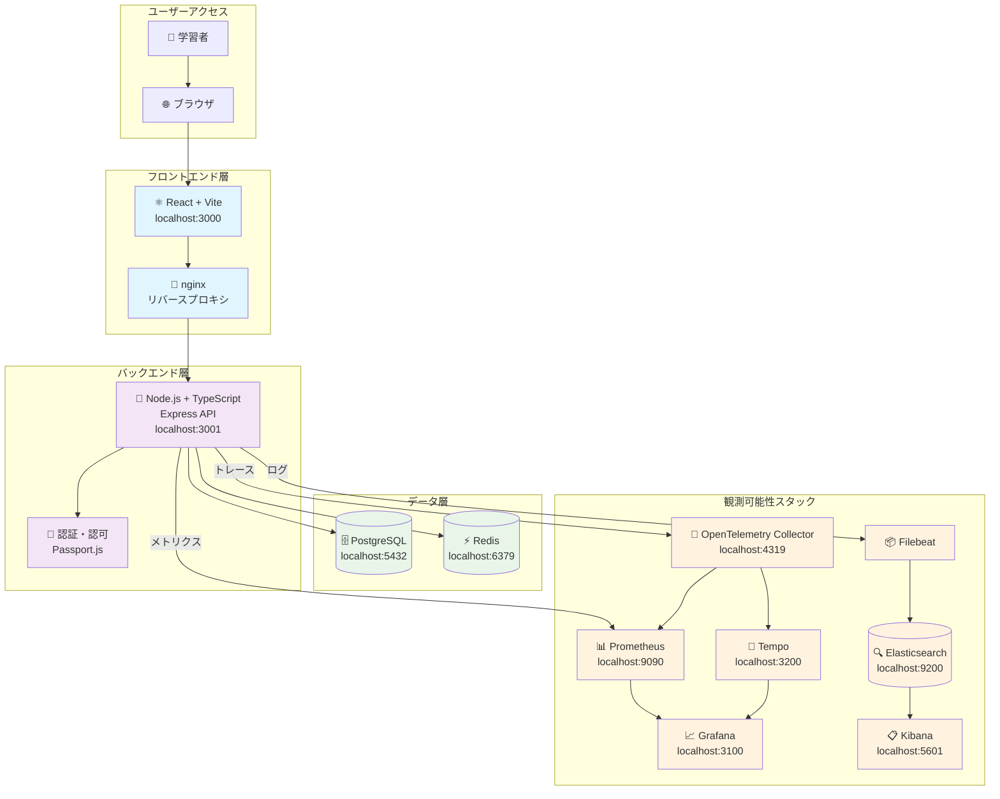
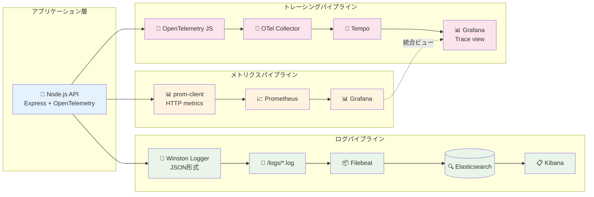

# チーム学習プラットフォーム - システム設計書

## システムの目的と概要

このプラットフォームは、AWS ECS管理者がKubernetesを学習するための包括的な実践環境です。Docker Composeベースの統合開発環境から始まり、段階的にKubernetes環境への移行を支援します。

### 基本方針
- **段階的学習**: Docker Compose → Kubernetes への自然な移行
- **実践重視**: 実際のマイクロサービス環境での学習
- **観測可能性**: 本格的なモニタリング・ログ管理の実践
- **AWS ECS比較**: 既存ECS知識の活用とKubernetes概念の対比

## システム全体アーキテクチャ

## データフロー: 観測可能性の三本柱

## コンポーネント詳細仕様

### フロントエンド (React + Vite)
- **技術スタック**: React 18, TypeScript, Material-UI
- **主要機能**: 
  - Kubernetes学習コンテンツ表示
  - 進捗管理・チーム管理画面
  - API通信・認証機能
- **AWS ECS比較**: ECS TaskDefinition UI ↔ K8s Pod管理画面

### バックエンド (Node.js + Express)
- **技術スタック**: Node.js 18, TypeScript, Express, Passport.js
- **主要機能**:
  - RESTful API提供
  - 認証・認可 (JWT + OAuth)
  - 学習進捗管理・チーム管理
- **AWS ECS比較**: ECS Service ↔ K8s Deployment概念の実装

### データベース設計
- **PostgreSQL**: ユーザー・チーム・学習進捗データ
- **Redis**: セッション管理・キャッシュ・レート制限
- **AWS ECS比較**: RDS ↔ K8s StatefulSet + PV/PVC

### 観測可能性スタック
- **メトリクス**: Prometheus + Grafana (ECS CloudWatch ↔ K8s Metrics Server)
- **ログ**: Filebeat + Elasticsearch + Kibana (ECS FireLens ↔ K8s Fluentd)
- **トレーシング**: OpenTelemetry + Tempo (ECS X-Ray ↔ K8s Jaeger/Tempo)

## セキュリティ考慮事項

### 認証・認可
- JWT + Refresh Token方式
- OAuth 2.0 (Google, GitHub)
- RBAC (Role-Based Access Control)

### ネットワークセキュリティ
- CORS設定
- レート制限 (Redis-based)
- セッション管理

### データ保護
- パスワードハッシュ化 (bcrypt)
- 環境変数による機密情報管理
- データベース接続暗号化

## スケーラビリティ設計

### 水平スケーリング対応
- ステートレスAPIサーバー設計
- Redis共有セッション
- データベース接続プーリング

### Kubernetes移行準備
- 12-Factor App準拠
- 環境変数による設定外部化
- ヘルスチェックエンドポイント実装

### AWS ECS → Kubernetes 移行マッピング

| AWS ECS | Kubernetes | 実装状況 |
|---------|------------|----------|
| Task Definition | Pod Spec | 🔄 Docker設定完了 |
| Service | Deployment | 🔄 Docker Compose設定 |
| ALB | Ingress + Service | ⏳ 計画中 |
| CloudWatch | Prometheus + Grafana | ✅ 完了 |
| FireLens | Filebeat + Fluentd | ✅ Filebeat完了 |
| X-Ray | OpenTelemetry + Tempo | ✅ 完了 |
| EFS | PersistentVolume | ⏳ 計画中 |
| Parameter Store | ConfigMap + Secret | ⏳ 計画中 |

---

**📋 設計基準**: Kubernetes公式ドキュメント + AWS ECSベストプラクティス  
**🎯 学習目標**: 実践的なマイクロサービス運用とKubernetes概念理解  
**📊 進捗**: 基盤構築75%完了、統合テスト25%残り
